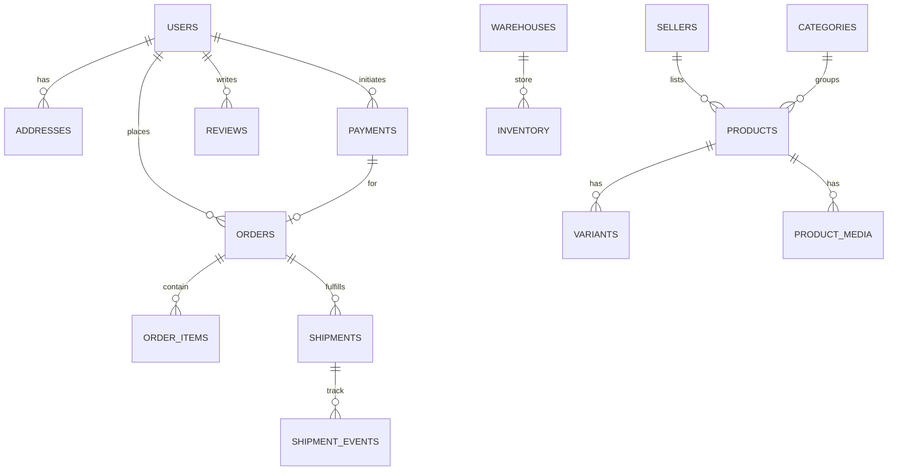
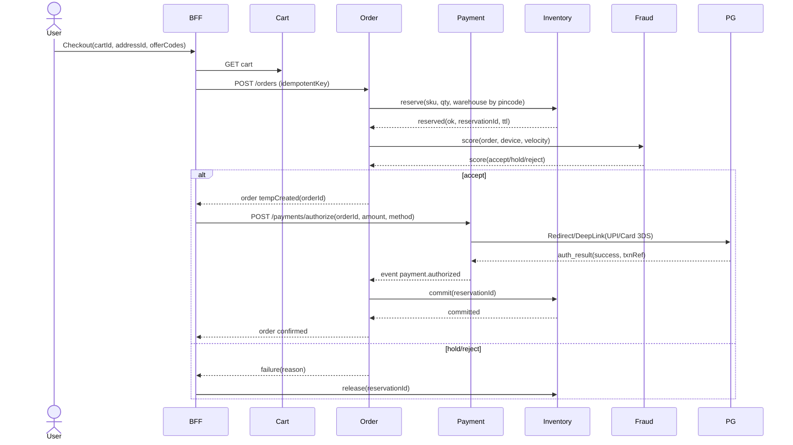
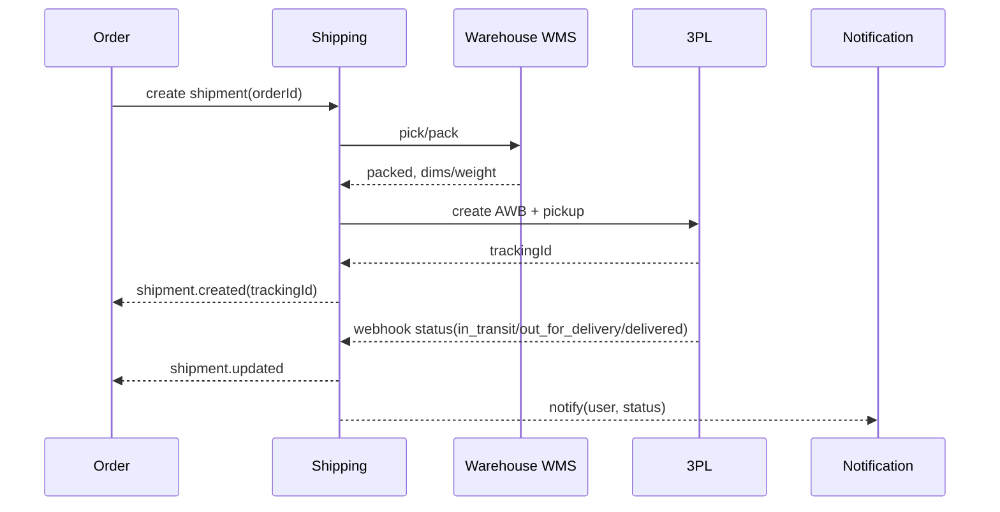
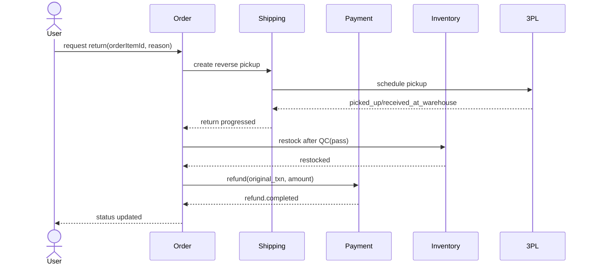
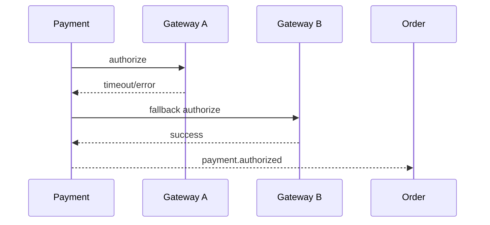

awesome—let’s design a Flipkart-scale e-commerce platform end-to-end. I’ll keep it structured and actionable with clear boundaries, diagrams, schemas, APIs, and ops guidance. If you want any part turned into real Helm charts or OpenAPI JSON, say the word and I’ll drop full files.

# 1) Goals, SLAs & Guiding Principles

* **Scale:** 10–50M DAU, peak 1–3k requests/sec per core domain, flash-sale spikes 10×.
* **SLOs:** p95 API latency < **300ms**, p99 < 800ms (read paths); checkout p95 < 1.2s.
* **Availability:** **99.99%** (multi-AZ, multi-region active-active for reads; active-passive for write-heavy if needed).
* **Consistency model:** Strong where money/inventory moves; eventual where UX tolerates (feeds, recommendations).
* **Architecture style:** Domain-driven microservices with async eventing (Kafka), “API Gateway + BFF(s)”, CQRS on Order/Payment.
* **Security & compliance:** PCI DSS (card data segregated), GDPR (DSRs), RBI/UPI norms for India.

---

# 2) High-Level Architecture

```mermaid
graph LR
  subgraph Edge
    CDN[CDN + WAF] --> APIGW[API Gateway/Ingress]
    APIGW --> BFF[Web/iOS/Android BFF]
  end

  BFF -->|REST/GraphQL| UMS[User/Auth Service]
  BFF --> Catalog[Catalog Service]
  BFF --> Search[Search API]
  BFF --> Cart[Cart Service]
  BFF --> Wishlist[Wishlist Service]
  BFF --> Order[Order Service]
  BFF --> Payment[Payment Orchestrator]
  BFF --> Offer[Offers/Promo Service]
  BFF --> Review[Reviews/Ratings]
  BFF --> Notify[Notification Service]
  BFF --> CS[Customer Support]
  BFF --> Seller[SaaS Seller Portal API]
  BFF --> Admin[Admin API]

  Catalog --> Media[Media/Asset Service]
  Catalog --> Inv[Inventory Service]
  Order --> Inv
  Order --> Ship[Shipping/Fulfillment Service]
  Order --> Invoice[Invoice/Tax Service]
  Payment --> Fraud[Risk/Fraud Service]
  Payment --> PG[Payment Gateway Aggregator]
  Ship --> 3PL[Delivery Partners (3PL APIs)]

  UMS --> Secrets[Secrets/KMS]
  subgraph Data Plane
    RDS[(Aurora/Postgres)]
    Redis[(Redis/ElastiCache)]
    ES[(OpenSearch/Elastic)]
    S3[(Object Storage)]
    Dynamo[(DynamoDB/Cassandra)]
    Click[(ClickHouse/BigQuery)]
    Kafka[(Kafka/MSK)]
  end

  Catalog---ES
  Media---S3
  Cart---Redis
  Wishlist---Dynamo
  UMS---RDS
  Order---RDS
  Payment---RDS
  Inv---RDS
  Offer---RDS
  Review---RDS
  Notify---Redis
  CS---RDS
  Admin---Click

  All[All services] -.metrics/logs/traces.-> Obs[Prometheus + Grafana + Loki + Jaeger]
  All -.events.-> Kafka
  ETL[Stream/Batch ETL] --> Click
  Kafka --> SearchIndexer[Search Indexer]
  SearchIndexer --> ES
```

> **Cloud mapping (AWS):** CloudFront (CDN), WAF, ALB/NLB + API Gateway or Istio Ingress, EKS, MSK (Kafka), Aurora Postgres, DynamoDB, ElastiCache Redis, OpenSearch, S3, KMS, Secrets Manager, Route 53, Glue/Lambda/Data Pipelines + ClickHouse managed or BigQuery(GCP)/Synapse(Azure) alternative.

---

# 3) Service-by-Service Design (boundaries, storage, key APIs)

**Common patterns**

* Protocols: REST (JSON) + async events (Kafka, Avro/Protobuf). GraphQL only at **BFF**.
* IDs: 128-bit Snowflake/ULID.
* Outbox pattern for reliable event publish.
* Auth: OAuth2/OIDC (Keycloak/Cognito/Auth0). JWT (short-lived) + refresh tokens (Rotating).
* Caches: Redis for hot entities; local LRU/HTTP cache w/ ETags.

### 3.1 User & Auth Service (UMS)

* **Responsibilities:** Signup/login (email/phone/OTP/SSO), profiles, addresses, roles/permissions, session mgmt.
* **Storage:** Aurora (users, addresses, sessions), Redis (session cache), KMS for PII column encryption.
* **APIs (sample)**

  * `POST /v1/users` (signup), `POST /v1/auth/login`, `POST /v1/auth/otp/verify`
  * `GET/PUT /v1/users/{id}/profile`, `GET/POST/DELETE /v1/users/{id}/addresses`
* **Events:** `user.created`, `address.updated`.

### 3.2 Catalog Service

* **Responsibilities:** Products, variants (size/color), attributes, categories, brands, media refs, seller listings, SPUs/Skus.
* **Storage:** Aurora (normalized catalog), S3 (images/video), OpenSearch index for searchables.
* **APIs:**

  * `GET /v1/products/{id}` (joins variants, rich content)
  * `GET /v1/categories/tree`
  * Internal: `POST /v1/products` (seller/admin), bulk ingest.
* **Events:** `product.upserted`, `price.changed`, `listing.statusChanged`.

### 3.3 Search API + Indexer

* **Responsibilities:** Full-text, filters, facet counts, suggestion/autocomplete, spelling.
* **Storage:** OpenSearch (primary), Redis for hot query cache.
* **APIs:** `POST /v1/search` (query + filters + sort + pagination), `GET /v1/suggest?q=...`
* **Pipelines:** Kafka consumers from Catalog & Inventory to refresh index (near-real-time).

### 3.4 Cart Service

* **Responsibilities:** Per-user cart; add/remove/update; price calc; “save for later”.
* **Storage:** Redis (primary) with TTL + snapshot to DynamoDB for resilience.
* **APIs:** `GET/PUT/POST /v1/cart`, `POST /v1/cart/items`, `PATCH /v1/cart/items/{id}`
* **Notes:** price/stock verified again at checkout.

### 3.5 Wishlist Service

* **Storage:** DynamoDB (partition key `userId`, sort `skuId`), GSI on updatedAt.
* **APIs:** `GET/POST/DELETE /v1/wishlist/items`

### 3.6 Offers/Promo Service

* **Responsibilities:** Coupons, category/seller promos, flash sales, loyalty points, membership (Plus).
* **Storage:** Aurora (promo definitions), Redis (compiled rules), Kafka for flash sale toggles.
* **APIs:** `POST /v1/offers/validate`, `POST /v1/loyalty/apply`, `GET /v1/memberships/{userId}`

### 3.7 Order Service (CQRS)

* **Responsibilities:** Order creation, state machine, invoice generation, cancellations/returns.
* **Storage:**

  * **Command side:** Aurora (orders, items, payments link), Outbox events.
  * **Event store** (optional): Kafka topic `order.events` persisted to S3/ClickHouse.
  * **Query side:** Read model (denormalized views) in Aurora/Elastic.
* **APIs:**

  * `POST /v1/orders` (idempotentKey, cartId)
  * `GET /v1/orders/{id}`, `POST /v1/orders/{id}/cancel`, `POST /v1/orders/{id}/return`
* **Events:** `order.created`, `order.confirmed`, `order.shipped`, `order.delivered`, `order.cancelled`, `return.requested`.

### 3.8 Payment Orchestrator

* **Responsibilities:** Gateway routing (Razorpay/PayU/Stripe et al), UPI, COD, wallet, retries, refunds, 3-D Secure/OTP flows.
* **Storage:** Aurora (payments, attempts, refunds), Vault/Tokenization via PSP, no PAN storage.
* **APIs:**

  * `POST /v1/payments/authorize` (amount, method, orderRef)
  * `POST /v1/payments/capture`
  * `POST /v1/payments/refund`
  * Webhooks: `/v1/payments/webhook/{provider}`
* **Events:** `payment.authorized`, `payment.captured`, `payment.failed`, `payment.refunded`.

### 3.9 Fraud/Risk Service

* **Responsibilities:** Real-time scoring (rules + ML), velocity checks, device fingerprint, geolocation, blacklist.
* **Storage:** Redis (velocity), ClickHouse (features), feature store (Feast).
* **APIs:** `POST /v1/fraud/score` (sync for checkout), async enrichment via Kafka.

### 3.10 Inventory Service

* **Responsibilities:** Stock per SKU per warehouse; reservations; decrements on capture or ship.
* **Storage:** Aurora (inventory\_ledger), Redis (hot availability), optionally Dynamo for high-write reservations.
* **APIs:** `POST /v1/inventory/reserve`, `POST /v1/inventory/commit`, `POST /v1/inventory/release`, `GET /v1/inventory/availability?sku=...&pincode=...`
* **Events:** `inventory.reserved`, `inventory.decremented`, `inventory.restocked`.

### 3.11 Shipping/Fulfillment

* **Responsibilities:** Warehouse selection, pick/pack/ship, AWB creation, 3PL integration, tracking, CoD reconciliation.
* **Storage:** Aurora (shipments), Webhook logs (S3).
* **APIs:** `POST /v1/shipments`, `GET /v1/shipments/{id}/track`
* **Events:** `shipment.labelCreated`, `shipment.pickedUp`, `shipment.inTransit`, `shipment.delivered`.

### 3.12 Notification Service

* **Responsibilities:** Templates, fan-out to Email/SMS/Push/WhatsApp, provider failover, user prefs.
* **Storage:** Redis (rate limits), Aurora (templates, prefs).
* **APIs:** `POST /v1/notifications/send` (eventType + payload), webhooks from providers.

### 3.13 Reviews & Ratings

* **Responsibilities:** Product & seller reviews, moderation (ML + rules), helpful votes.
* **Storage:** Aurora (reviews), OpenSearch (review search), Redis (rate-limit).
* **APIs:** `POST /v1/reviews`, `GET /v1/products/{id}/reviews`

### 3.14 Seller Portal

* **Responsibilities:** Onboarding/KYC, catalog upload, pricing, order handling, settlements.
* **Storage:** Aurora (sellers, settlements), S3 (docs), Redshift/ClickHouse for reports.
* **APIs:** `POST /v1/sellers/onboard`, `POST /v1/seller/{id}/products/bulk`, `GET /v1/seller/{id}/orders`

### 3.15 Admin Portal

* **Responsibilities:** Analytics, moderation, fraud ops, price overrides, inventory dashboards.
* **Storage:** ClickHouse/BigQuery, OpenSearch (ops search).
* **APIs:** admin-scoped; RBAC enforced; audit logging everywhere.

### 3.16 Customer Support

* **Responsibilities:** Chatbot + agent handoff, ticketing, order lookup, refunds, escalations.
* **Integrations:** Zendesk/Freshdesk style or in-house; bot via LLM gateway restricted with guardrails.

---

# 4) Data Models (Relational & NoSQL)

## 4.1 ER (core relational)



**Key tables (Aurora/Postgres)**

* `users(id, email, phone, password_hash, status, created_at, ... )`
* `addresses(id, user_id, line1, city, state, pincode, country, ... )` (PII columns encrypted)
* `sellers(id, legal_name, kyc_status, ... )`
* `categories(id, parent_id, name, path, ... )` (index on `path` for tree)
* `products(id, seller_id, category_id, title, description_md, brand, status, ... )`
* `variants(id, product_id, sku, attributes_jsonb, mrp, price, gst_rate, weight, dims, ... )`
* `product_media(id, product_id, url, type, position)`
* `inventory(id, warehouse_id, sku, available_qty, reserved_qty, updated_at)`
* `orders(id, user_id, status, address_snapshot_jsonb, total, currency, channel, created_at, ...)`
* `order_items(id, order_id, sku, title, price, qty, tax, seller_id, ... )`
* `payments(id, order_id, method, amount, status, provider, txn_ref, created_at, ... )`
* `shipments(id, order_id, warehouse_id, carrier, awb, status, created_at, ... )`
* `shipment_events(id, shipment_id, code, description, event_ts, location)`
* `returns(id, order_item_id, reason_code, status, refund_amount, created_at, ... )`
* `offers(id, type, rules_jsonb, active_from, active_to, status)`
* `reviews(id, user_id, product_id, rating, title, body, status, created_at, ... )`

**NoSQL structures**

* **Cart (Redis hash):** `cart:{userId}` → `{ items:[{sku, qty, unitPriceSnapshot, sellerId}], updatedAt }`
* **Wishlist (DynamoDB):** PK=`USER#{userId}`, SK=`SKU#{sku}`, attributes `{addedAt}`
* **Search index (OpenSearch doc):** `{ productId, title, brand, categoryPath, attrs, minPrice, rating, facets, availablePincodes }`
* **Event store (Kafka→S3/ClickHouse):** append-only `order.events`, `payment.events` with schema evolution.

**Indexing highlights**

* Products: `btree(category_id)`, `GIN (attrs_jsonb)`, trigram index on `title` for fallback search.
* Orders: `btree(user_id, created_at desc)`, `btree(status)`.
* Payments: `btree(order_id)`, `btree(status, created_at)`.
* Inventory: `btree(sku, warehouse_id)`.

---

# 5) Key Workflows (Sequence Diagrams)

## 5.1 Order Placement (Card/UPI)



## 5.2 Shipment & Delivery Tracking



## 5.3 Returns & Refunds



## 5.4 Payment Retry/Failover



---

# 6) Functional Scope (deep dive highlights)

### 6.1 User Management

* Email/phone signup, OTP/2FA, Google/Apple SSO.
* RBAC: roles `USER`, `SELLER`, `ADMIN` with scoped APIs.
* Address validation with pincode/geo service; default shipping address.

### 6.2 Product Catalog & Search

* Category tree (3–5 levels), facets from attributes (size/color/material).
* Media: image transforms (thumb/zoom/webp) via async workers; CDN cache keys include `w,h,q`.
* Search: BM25 + synonyms, “did-you-mean”, popularity boost, personalization signals.

### 6.3 Cart & Wishlist

* Multi-seller cart lines; coupon pre-validation; tax/GST computation; shipping SLA estimator per pincode.

### 6.4 Orders

* Idempotent creation; inventory **reserve→commit** pattern; invoice PDF (GST compliant).
* Cancellations: before ship (auto), after ship (RTO/return policy).
* Order tracking links federated from 3PL.

### 6.5 Payments

* Methods: UPI, Cards, Netbanking, Wallets, COD. Tokenized instruments for 1-click.
* Refunds: full/partial; reconcile with gateway settlements.

### 6.6 Inventory

* Multi-warehouse; sourcing logic: nearest with stock & SLA; safety stock, backorders (optional).
* Real-time updates from sellers/WMS via webhooks or SFTP→ingest.

### 6.7 Shipping & Delivery

* SLA matrix by pincode×carrier; NDR handling; COD verification; doorstep OTP on delivery.

### 6.8 Notifications

* Event-driven: order placed/shipped/delivered, payment status, offers. Template localization (en/hi/…).

### 6.9 Reviews & Ratings

* Purchase-verified gating; profanity filter; ML for abuse/spam; helpfulness ranking.

### 6.10 Offers & Discounts

* Rules DSL (scope: product/category/seller/user/loyalty), combinability matrix, flash sale switch with TTL cache.

### 6.11 Seller Portal

* KYC (PAN/GST docs), catalog bulk CSV/XLSX, image uploader, pricing, order SLA dashboard, settlements & disputes.

### 6.12 Admin Portal

* Ops dashboards, anomaly alerts (orders, payments, inventory), catalog moderation queue, fraud casework.

### 6.13 Customer Support

* Bot for FAQs & order status; agent console with unified customer timeline; SLA-based routing & escalation.

---

# 7) Scalability & Performance Plan

* **Horizontal scaling everywhere:** stateless services on Kubernetes with HPA (CPU, p95 latency via custom metrics).
* **Caching tiers:**

  1. CDN edge for media & static, API cache for public GETs (short TTL with ETag/Last-Modified).
  2. Redis for product tiles, price, availability, user sessions, cart.
* **Database scaling:** Aurora read replicas; partition large tables (orders by month or hash by `id`), `autovacuum` tuning.
* **Sharding:** If a single orders table grows beyond, use **hash-sharded schemas** or adopt Citus/Spanner equivalent.
* **Search:** Multi-node OpenSearch with sharded indices, ILM (hot-warm-cold), replicas=2 for high QPS.
* **Kafka:** 3–5 brokers/region, replication 3, fsync, idempotent producers, consumer groups with DLQs.
* **Backpressure:** Circuit breakers (resilience4j), timeouts, retries with jitter, DLQ for poison messages.
* **Flash sale mode:** Feature flag to lower asset TTLs, pre-warm caches, queue checkout (virtual waiting room) when needed.

---

# 8) Security & Compliance

* **Transport:** TLS 1.2+, HSTS, mTLS for east-west (service mesh).
* **AuthN/Z:** OAuth2/OIDC, short-lived JWT (aud/iss checks), fine-grained scopes, CSRF tokens for web forms, SameSite cookies.
* **Hardening:** WAF rules, bot management, rate limits per API key/user/IP, secret rotation (AWS Secrets Manager).
* **Data:** At rest encryption (KMS), PII field-level encryption, key rotation; least-privilege IAM.
* **PCI DSS:** Cardholder Data Environment isolated (separate VPC/namespace), use PSP tokenization, never store PAN/CVV, quarterly ASV scans, annual SAQ-D or A-EP as applicable.
* **GDPR/DPDP:** Consent capture, DSR APIs (export/delete), data minimization & TTLs, audit logs (tamper-evident).
* **AppSec:** SAST/DAST in CI, dependency scanning, SBOMs, signing container images, admission controller checks.
* **Frontend:** CSP, XSS/Clickjacking headers, input validation, content sanitization for reviews.

---

# 9) Observability, Monitoring & Alerting

* **Stack:** OpenTelemetry → Prometheus (metrics), Grafana (dashboards), Loki/ELK (logs), Jaeger (traces), Alertmanager (paging).
* **RED/USE metrics per service:**

  * API: Requests, Errors, Duration (p50/p95/p99), saturation (threads/CPU).
  * Kafka: consumer lag, rebalance rate, DLQ rate.
  * DB: QPS, slow queries, locks, replication lag, buffer/cache hit ratio.
  * Search: qps, latency, shard health, heap.
  * Payments: auth success %, fallback rate, refund backlog.
  * Inventory: reserve failure %, stale reservations, stockout rate.
  * Shipping: webhook delay, undelivered %, RTO rate.
* **SLOs & alerts:** error budget burn alerts, anomaly detection for order volume/payment drops.

---

# 10) DevOps & Deployment

* **CI/CD:** GitHub Actions/Jenkins + BuildKit; unit/integration/contract tests, security scans; canary via Argo Rollouts, blue-green ability.
* **Kubernetes:** EKS/GKE/AKS; namespaces per env; HPA, VPA, PodDisruptionBudgets, PodSecurityPolicies/OPA Gatekeeper; autoscaling node groups.
* **Service mesh:** Istio/Linkerd for mTLS, retries, traffic shifting, metrics.
* **Infra as Code:** Terraform + Helm.
* **Environments:** dev → stage → prod; feature flags for dark launches.
* **Artifacts:** versioned Docker images, provenance (SLSA).

**Sample Helm values (order-service)**

```yaml
# charts/order-service/values.yaml (excerpt)
image:
  repository: registry.example.com/order-service
  tag: "1.3.7"
replicaCount: 6
resources:
  requests: { cpu: "500m", memory: "1Gi" }
  limits:   { cpu: "2", memory: "3Gi" }
env:
  - name: DB_URL
    valueFrom: { secretKeyRef: { name: order-db, key: url } }
  - name: KAFKA_BROKERS
    value: "kafka-1:9092,kafka-2:9092"
service:
  type: ClusterIP
  port: 8080
ingress:
  enabled: true
  className: istio
  hosts: [ "api.example.com" ]
hpa:
  enabled: true
  minReplicas: 6
  maxReplicas: 60
  targetCPUUtilizationPercentage: 60
podDisruptionBudget:
  minAvailable: 80%
```

---

# 11) Technology Recommendations

* **Backend:** Java 21 + Spring Boot 3 (your stack), Kotlin optional; gRPC for internal hot paths where handy.
* **Frontend:** Web (Angular), iOS (Swift), Android (Kotlin). BFF in Node/TypeScript (NestJS) or Spring WebFlux.
* **Databases:** Aurora Postgres for OLTP; DynamoDB for wishlist/session-like; Redis for caching; OpenSearch for search; ClickHouse/BigQuery for analytics.
* **Messaging:** Apache Kafka (MSK) + Schema Registry (Confluent/Redpanda alt).
* **Cache:** Redis/ElastiCache.
* **CDN:** CloudFront/Akamai.
* **Auth:** Keycloak/Cognito.
* **ML/Fraud:** Python microservice with Feast, LightGBM/XGBoost; streaming features via Kafka.
* **3PL/Payments (IN):** Razorpay/PayU/PhonePe for UPI/cards; Shiprocket/Delhivery/Ekart for logistics.

---

# 12) API Contracts (illustrative)

**Order Create (REST)**

```http
POST /v1/orders
Headers: Idempotency-Key: <uuid>, Authorization: Bearer <jwt>
Body: {
  "cartId":"c_123",
  "shippingAddressId":"a_456",
  "paymentMethod":"UPI",
  "offerCodes":["NEW10"]
}
200 OK { "orderId":"o_789", "status":"CONFIRMED", "amount": { "total": 1249.00, "currency":"INR" } }
409 CONFLICT (idempotent replay returns existing orderId)
422 UNPROCESSABLE_ENTITY (stock/price changed)
```

**Payment Authorized (event) – Avro**

```json
{
  "eventType": "payment.authorized",
  "schemaVersion": "2",
  "data": {
    "paymentId":"pay_1",
    "orderId":"o_789",
    "amount":1249.00,
    "provider":"Razorpay",
    "method":"UPI",
    "authRef":"xyz",
    "timestamp":"2025-08-16T14:18:00Z"
  }
}
```

---

# 13) Workload-Specific Low-Level Details

* **Inventory reservations:** store `reservation_id, sku, qty, warehouse_id, expires_at`; Redis SET with TTL; background sweeper to release.
* **Price calc pipeline:** base price → seller/offer price → cart-level coupon → shipping → taxes → final; keep a **price breakdown** json for audits.
* **Search freshness:** change data capture from Aurora (Debezium) → Kafka → Indexer; partial updates to ES docs.
* **Media:** async image resize using queue workers; signed URLs; cache-busting by hash.
* **Idempotency:** hash of request body + userId as key in Redis with result pointer (5–15 min TTL).
* **Concurrency control:** optimistic locks on order rows; explicit `FOR UPDATE SKIP LOCKED` for queue consumers.

---

# 14) Deployment Topology & Networking

* **VPC:** public subnets (ALB/NLB), private subnets (EKS nodes, DBs), isolated subnets (PCI zone).
* **API Gateway/Ingress:** rate limiting, JWT validation at edge, header normalization.
* **Service mesh:** traffic policies, mutual TLS, retries/timeouts declarative.
* **Global:** Route 53 latency-based routing; multi-region with read-only ES replicas & active-active Kafka via MirrorMaker2 (or region-scoped topics + async replication).

---

# 15) Backup & Disaster Recovery

* **RPO/RTO targets:** RPO ≤ 5 min, RTO ≤ 30 min (critical paths), ≤ 2h (analytics).
* **Aurora:** cross-region replicas + PITR; automated daily snapshots.
* **Dynamo:** point-in-time recovery.
* **OpenSearch:** snapshot to S3 hourly for hot indices; reindex automation.
* **Kafka:** cross-region mirroring; topic retention sizing > peak replay window.
* **S3:** versioning + replication.
* **DR Runbooks:** game days, chaos testing (pod/node/az failure; gateway outage; PSP failure).

---

# 16) Sequence of Data Privacy/GDPR (India DPDP) Controls

* **Data map:** tag PII columns; encrypt at field; limit joins to services with need-to-know.
* **DSR APIs:** `GET /v1/privacy/export`, `DELETE /v1/privacy/erase` (asynchronous with tombstone events).
* **Retention:** reviews keep pseudonymous userId; orders retained per legal/tax (7–8 years).

---

# 17) Example Database Schemas (SQL snippets)

```sql
CREATE TABLE orders (
  id            TEXT PRIMARY KEY,
  user_id       TEXT NOT NULL,
  status        TEXT NOT NULL CHECK (status IN ('CREATED','CONFIRMED','SHIPPED','DELIVERED','CANCELLED','RETURN_REQUESTED','RETURNED')),
  address_snapshot JSONB NOT NULL,
  price_breakdown  JSONB NOT NULL,
  currency     CHAR(3) NOT NULL DEFAULT 'INR',
  created_at   TIMESTAMPTZ NOT NULL DEFAULT now(),
  updated_at   TIMESTAMPTZ NOT NULL DEFAULT now()
);

CREATE TABLE order_items (
  id           TEXT PRIMARY KEY,
  order_id     TEXT REFERENCES orders(id),
  sku          TEXT NOT NULL,
  title        TEXT NOT NULL,
  price        NUMERIC(12,2) NOT NULL,
  qty          INT NOT NULL CHECK (qty > 0),
  tax_pct      NUMERIC(5,2),
  seller_id    TEXT NOT NULL
);

CREATE INDEX idx_orders_user_created ON orders(user_id, created_at DESC);
```

---

# 18) Monitoring Dashboards (what to track)

| Service       | Key Panels                                                                    |
| ------------- | ----------------------------------------------------------------------------- |
| API/BFF       | RPS, p50/p95/p99 latency, error rate by endpoint, saturation                  |
| Order         | create latency, idempotency hits, reserve→commit latency, cancel/return rates |
| Payment       | auth success %, fallback share, gateway latencies, refund backlog/age         |
| Inventory     | reserve failures, stale reservations, stock accuracy %, low-stock alerts      |
| Search        | query latency, top queries, zero-result %, shard health, GC pauses            |
| Shipping      | webhook lag, in-transit→delivered SLA, RTO %, NDR reasons                     |
| Notifications | send success %, provider failovers, queue depth                               |
| Fraud         | decision latency, false positive/negative estimates, device velocity hits     |

---

# 19) Latency Budget (typical)

* Product detail page: CDN(20ms) + API(120ms) + search suggestions(80ms) → **<250ms p95**.
* Checkout submit: cart verify(60) + reserve(70) + fraud(40) + payment redirect(PSP user time excluded) + confirm(80) → **<1.2s p95** before PSP step.

---

# 20) Risks & Mitigations

* **Hot keys (flash sales):** sharded counters, randomize cache keys, pre-allocation batches.
* **Stock races:** reservation TTL + commit with idempotency; compensating releases on failure.
* **Payment webhooks loss:** provider retries + signed webhooks + idempotent handler + outbox.
* **Search lag:** CDC with backpressure; bulk throttling; stale-while-revalidate cache.
* **Vendor dependencies:** circuit breakers + graceful degradation (e.g., hide low-value widgets).

---

# 21) Roadmap (MVP → Scale)

1. MVP: UMS, Catalog, Search, Cart, Checkout (Order/Payment/Inventory), Shipping basic, Notifications, Reviews, Offers lite.
2. Scale: multi-warehouse sourcing, advanced fraud, seller portal, analytics lakehouse, loyalty.
3. Hardening: multi-region, chaos, flash-sale mode, PCI scope reduction, full automation runbooks.

---

## Want artifacts?

I can generate:

* **Helm charts** per service (Order/Payment/Inventory) with HPA/PDB/NetworkPolicies.
* **OpenAPI** specs for all public/internal services.
* **Kafka schemas** (Avro) + outbox patterns.
* **Terraform** blueprints for AWS (EKS, MSK, Aurora, ElastiCache, OpenSearch, S3, KMS, WAF, CloudFront).

Tell me which parts you want as downloadable files first (e.g., “Order service OpenAPI + Helm”).


design angular app with mongo db, bootstrap to show monthly expenses to view 5 years and 10 years expenses after adding inflation. Add number of sips to view future return, investment. Add number of lump sum to view future return, investment. 