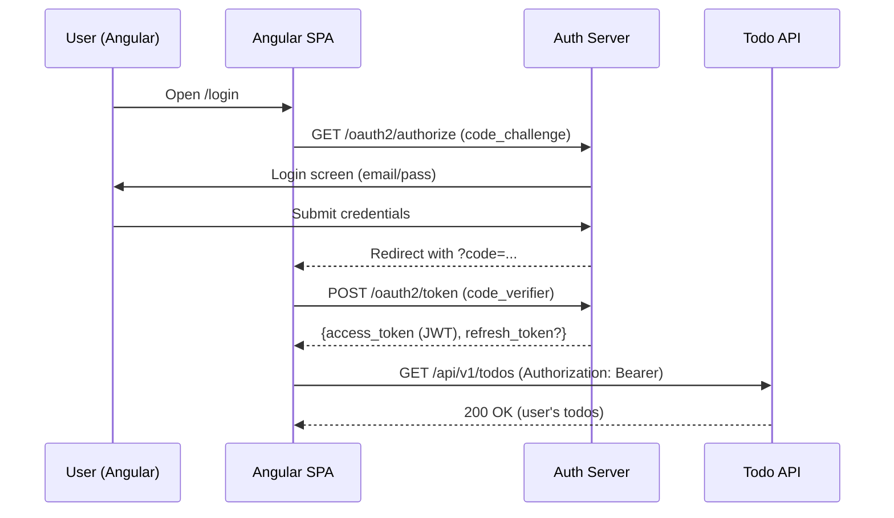
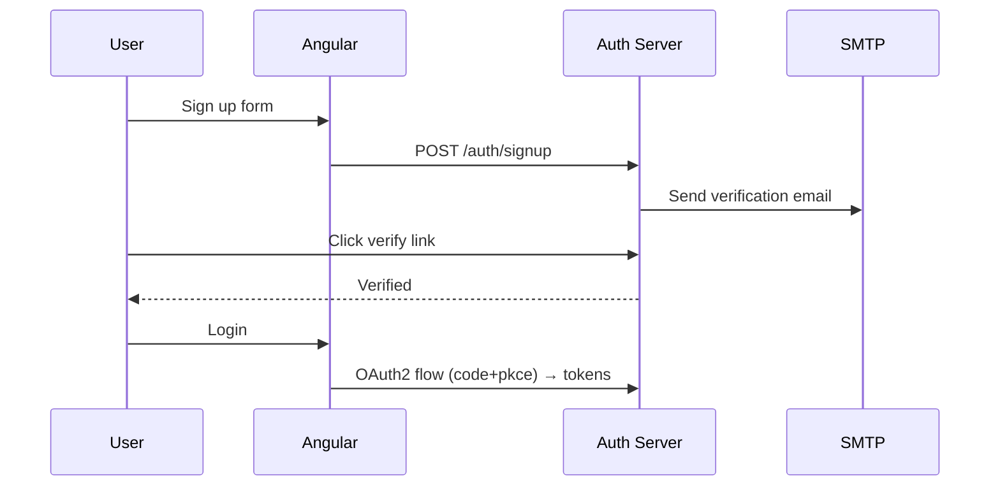
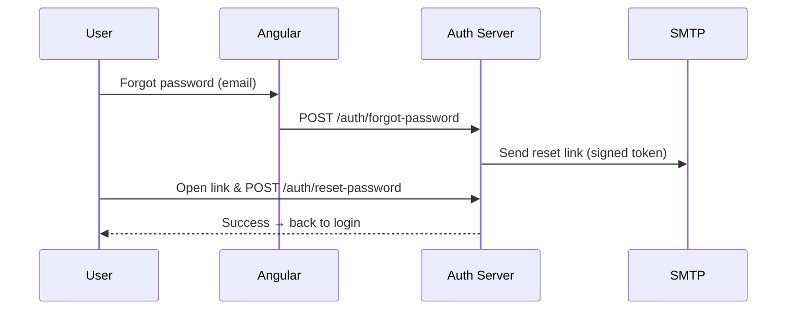
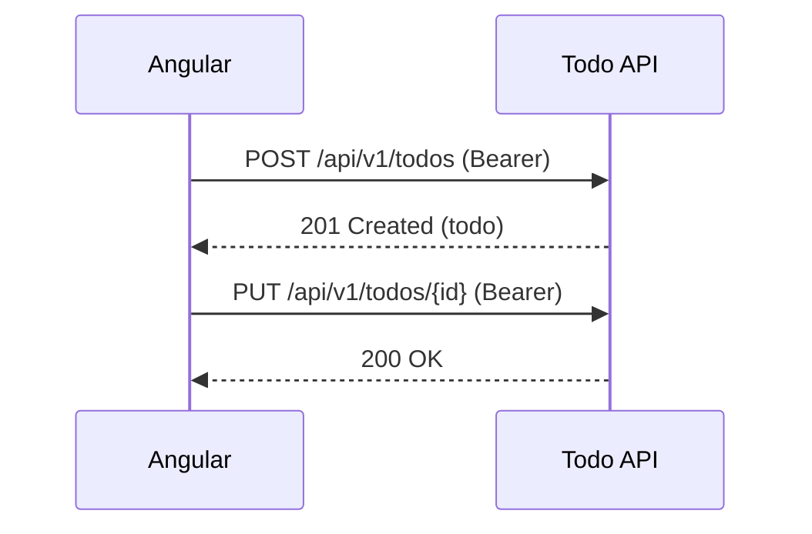

want to build an angular with bootstrap application called todo manager where. now use spring boot application to have oauth2 implementation as server and client to integrate with this angulation application. keep mysql as backend. now user can signup,login, forgetpassword, and other activity to manage his/her todo manager(add, edit, update, delete). design the architect.

Awesome—let’s design a clean, production-ready architecture for **Todo Manager**:

# 1) High-level architecture

**Front end**

* **Angular + Bootstrap** SPA
* Auth via **OAuth 2.1 Authorization Code + PKCE**
* Token handling: access token in memory; refresh via silent refresh endpoint (no localStorage for access token)
* Libraries: `angular-oauth2-oidc` (or custom PKCE flow), `HttpInterceptor` for bearer tokens, global error handler

**Back end (Spring Boot, split into services)**

1. **Auth Server** (Spring Authorization Server)

   * Issues JWT (RS256), refresh tokens
   * Supports: Signup (via user-mgmt endpoint), Login (OAuth2), Forgot/Reset password
   * User store in MySQL (BCrypt)
   * Email service for reset links (signed, short-lived token)
2. **Todo API (Resource Server)**

   * CRUD for todos
   * Validates JWT with Auth Server JWKS
   * Scopes: `todo.read`, `todo.write`; Roles: `ROLE_USER`, `ROLE_ADMIN`
   * Multi-tenant by `user_id` ownership
3. **Edge / API Gateway (optional)**

   * If you want single origin: route `/oauth2/*` and `/auth/*` to Auth Server, `/api/*` to Todo API
   * CORS centralized, rate-limit, request logging

**Shared**

* **MySQL** (separate schemas recommended)
* **OpenAPI 3** docs for both services
* **Observability**: actuator, logs (JSON), correlation-id
* **CI/CD**: GitHub Actions → build, test, containerize, deploy

---

# 2) Security flow (OAuth 2.1 + PKCE)

* **Grant**: Authorization Code with PKCE
* **Tokens**:

  * Access token (JWT, ~10–15 min), in-memory only
  * Refresh token (HTTP-only, Secure, SameSite=Strict cookie from Auth Server to app domain or rotated on refresh endpoint via backchannel)
* **Scopes**: `openid profile email todo.read todo.write`
* **CORS**: Allow Angular origin, restrict methods/headers
* **Keys**: RSA keypair managed by Auth Server, JWKS exposed at `/.well-known/jwks.json`
* **Password reset**: time-boxed signed token (e.g., 15 min), one-time use

---

# 3) Logical modules

**Auth Server**

* `auth-authorization`: OAuth2 endpoints, JWK/JWKS
* `auth-accounts`: signup, email verify, password reset
* `auth-admin`: client registrations (if dynamic), user/role admin
* `auth-mail`: templated emails (reset/verify)

**Todo API**

* `todo-domain`: entities, repositories, services
* `todo-web`: controllers, DTOs, validation
* `todo-security`: resource server config, scope→authority mapping
* `todo-audit`: audit trail, ownership checks

**Angular**

* `auth` module: login/callback/guard/interceptor
* `core` module: api service, error handler, loader
* `features/todos`: list, create/edit, filters, pagination
* `features/account`: signup, forgot/reset password, profile

---

# 4) Deploy diagram (concise)

* Browser (Angular) → (HTTPS) → API Gateway / Nginx

  * `/oauth2/*`, `/auth/*` → **Auth Server**
  * `/api/*` → **Todo API**
* Auth Server & Todo API → **MySQL** (separate schemas)
* Auth Server → SMTP (transactional emails)

---

# 5) Database schema (MySQL)

## 5.1 Auth schema (`auth_db`)

```sql
-- Users & Roles
CREATE TABLE users (
  id BIGINT PRIMARY KEY AUTO_INCREMENT,
  email VARCHAR(255) UNIQUE NOT NULL,
  password_hash VARCHAR(100) NOT NULL,
  first_name VARCHAR(100),
  last_name VARCHAR(100),
  email_verified BOOLEAN DEFAULT FALSE,
  created_at TIMESTAMP DEFAULT CURRENT_TIMESTAMP,
  updated_at TIMESTAMP DEFAULT CURRENT_TIMESTAMP ON UPDATE CURRENT_TIMESTAMP
);

CREATE TABLE roles (
  id BIGINT PRIMARY KEY AUTO_INCREMENT,
  name VARCHAR(50) UNIQUE NOT NULL -- e.g., ROLE_USER, ROLE_ADMIN
);

CREATE TABLE user_roles (
  user_id BIGINT NOT NULL,
  role_id BIGINT NOT NULL,
  PRIMARY KEY(user_id, role_id),
  FOREIGN KEY (user_id) REFERENCES users(id),
  FOREIGN KEY (role_id) REFERENCES roles(id)
);

-- OAuth2 Client Registration (if using DB-backed clients)
CREATE TABLE oauth2_registered_client (
  id VARCHAR(100) PRIMARY KEY,
  client_id VARCHAR(100) UNIQUE NOT NULL,
  client_id_issued_at TIMESTAMP DEFAULT CURRENT_TIMESTAMP,
  client_secret VARCHAR(200),
  client_secret_expires_at TIMESTAMP NULL,
  client_name VARCHAR(200) NOT NULL,
  client_authentication_methods VARCHAR(1000) NOT NULL,
  authorization_grant_types VARCHAR(1000) NOT NULL,
  redirect_uris VARCHAR(1000),
  scopes VARCHAR(1000),
  client_settings VARCHAR(2000),
  token_settings VARCHAR(2000)
);

-- Authorization Server tokens/consents (Spring Authorization Server tables)
-- oauth2_authorization, oauth2_authorization_consent (standard SAS DDL)
```

## 5.2 Todo schema (`todo_db`)

```sql
CREATE TABLE todos (
  id BIGINT PRIMARY KEY AUTO_INCREMENT,
  user_id BIGINT NOT NULL,                 -- FK to auth.users.id (or mirror user_id on signup)
  title VARCHAR(255) NOT NULL,
  description TEXT,
  status ENUM('NEW','IN_PROGRESS','DONE','BLOCKED') DEFAULT 'NEW',
  priority ENUM('LOW','MEDIUM','HIGH') DEFAULT 'MEDIUM',
  due_date DATE,
  created_at TIMESTAMP DEFAULT CURRENT_TIMESTAMP,
  updated_at TIMESTAMP DEFAULT CURRENT_TIMESTAMP ON UPDATE CURRENT_TIMESTAMP,
  FOREIGN KEY (user_id) REFERENCES auth_db.users(id)
);

-- Optional: audit
CREATE TABLE todo_audit (
  id BIGINT PRIMARY KEY AUTO_INCREMENT,
  todo_id BIGINT NOT NULL,
  user_id BIGINT NOT NULL,
  action VARCHAR(30) NOT NULL,   -- CREATE/UPDATE/DELETE/STATUS_CHANGE
  details JSON,
  created_at TIMESTAMP DEFAULT CURRENT_TIMESTAMP,
  FOREIGN KEY (todo_id) REFERENCES todos(id)
);
```

---

# 6) Service boundaries & APIs

## 6.1 Auth Server (ports: 9000)

* **OIDC Well-Known**: `GET /.well-known/openid-configuration`
* **JWKS**: `GET /.well-known/jwks.json`
* **Authorize**: `GET /oauth2/authorize`
* **Token**: `POST /oauth2/token`
* **UserInfo**: `GET /userinfo`
* **Signup**: `POST /auth/signup`
  *Req*: `{email, password, firstName?, lastName?}`
  *Resp*: `201 Created` (email verification optional)
* **Login**: browser redirects via `/oauth2/authorize`
* **Forgot Password**: `POST /auth/forgot-password`
  *Req*: `{email}` (send email with reset link)
* **Reset Password**: `POST /auth/reset-password`
  *Req*: `{token, newPassword}`
* **Introspect (optional)**: `POST /oauth2/introspect`
* **Logout**: front-channel OIDC logout (optional) + Angular cleanup

## 6.2 Todo API (ports: 8081) — Resource Server

* **List**: `GET /api/v1/todos?status=&page=&size=` (scope: `todo.read`)
* **Get**: `GET /api/v1/todos/{id}` (owner only)
* **Create**: `POST /api/v1/todos` (scope: `todo.write`)
* **Update**: `PUT /api/v1/todos/{id}`
* **Patch status**: `PATCH /api/v1/todos/{id}/status`
* **Delete**: `DELETE /api/v1/todos/{id}`
* **Me**: `GET /api/v1/me` (derived from JWT sub/email)

**Ownership rule**: every query filters by `user_id = principal.userId`. Admins can have elevated queries.

---

# 7) Angular integration (PKCE)

* Configure Authorization Code + PKCE with:

  * `issuer`: Auth Server base URL
  * `clientId`: `todo-angular-spa`
  * `redirectUri`: `https://app.example.com/auth/callback`
  * `postLogoutRedirectUri`: `/login`
  * `scope`: `openid profile email todo.read todo.write`
* **AuthGuard** for routes under `/app`
* **HttpInterceptor** to add `Authorization: Bearer <accessToken>` to `/api/*`
* **Token Refresh**:

  * Option A (recommended): back-channel refresh via a small BFF endpoint in Auth Server domain that exchanges refresh token kept in secure cookie, then returns a new short-lived access token to SPA.
  * Option B: SPA holds refresh token in httpOnly cookie (still better than memory/localStorage for refresh). Never store access token in persistent storage.

---

# 8) Key Spring configs (sketch)

**Auth Server**

* `spring-authorization-server` dependency
* Client `todo-angular-spa`:

  * `authorization_grant_types`: `authorization_code`, `refresh_token`
  * `redirect_uris`: SPA callback
  * `scopes`: `openid,profile,email,todo.read,todo.write`
  * `token_settings`: access 15m, refresh 7d, reuse disabled (rotate)
* Email: Spring Mail + templates (Thymeleaf/Freemarker)

**Todo API (Resource Server)**

* `spring-boot-starter-oauth2-resource-server`
* `jwt.jwk-set-uri` → Auth Server JWKS
* Method security: `@PreAuthorize("hasAuthority('SCOPE_todo.read')")`

---

# 9) Sequence diagrams (Mermaid)

## 9.1 Login (Auth Code + PKCE)



## 9.2 Signup + verify + first login



## 9.3 Forgot/Reset Password



## 9.4 Create/Update Todo



---

# 10) Validation & DTOs

**CreateTodoRequest**

```json
{
  "title": "Pay electricity bill",
  "description": "Before 7th",
  "priority": "HIGH",
  "dueDate": "2025-11-07"
}
```

**TodoResponse**

```json
{
  "id": 123,
  "title": "Pay electricity bill",
  "description": "Before 7th",
  "status": "NEW",
  "priority": "HIGH",
  "dueDate": "2025-11-07",
  "createdAt": "2025-11-01T08:30:00Z",
  "updatedAt": "2025-11-01T08:30:00Z"
}
```

Server-side:

* Bean Validation: `@NotBlank title`, `@Size`, `@FutureOrPresent dueDate`
* Ownership checks in service layer (userId from JWT `sub`/`email` mapped to internal `user_id`)

---

# 11) Non-functional concerns

* **CORS**: strict allowlist for SPA origin
* **Rate limiting**: login, forgot password
* **Brute-force protection**: lockouts, exponential backoff
* **Audit**: user + action + timestamp
* **Idempotency**: for create (optional)
* **Pagination**: list todos, default `size=20`
* **Search/Filters**: by `status`, `priority`, `dueDate` range
* **OpenAPI**: `/v3/api-docs`, Swagger UI for both services
* **Testing**:

  * Auth: WebMvc + OAuth2 tests, password reset flow
  * Todo: Slice tests, `@SpringBootTest` + Testcontainers MySQL
* **Observability**: traceId in logs, error maps, health checks
* **Migrations**: Flyway or Liquibase

---

# 12) Minimal client registrations (example)

* **todo-angular-spa**

  * Public client (no client secret)
  * Redirect: `https://app.example.com/auth/callback`
  * Grants: `authorization_code`, `refresh_token`
  * Scopes: `openid profile email todo.read todo.write`

* **todo-api-service** (if it ever needs machine-to-machine)

  * Client credentials (private) for internal tasks

---

# 13) Recommended folder layout

**Auth Server**

```
auth-server/
  src/main/java/.../config  (AuthorizationServerConfig, MailConfig)
  src/main/java/.../account (SignupController, ResetController, UserService)
  src/main/java/.../domain  (User, Role, Repo)
  src/main/java/.../mail    (templates, service)
  resources/db/migration    (Flyway)
```

**Todo API**

```
todo-api/
  src/main/java/.../security (ResourceServerConfig, JwtConverter)
  src/main/java/.../todo     (TodoController, Service, Repo, DTO)
  src/main/java/.../audit
  resources/db/migration
```

**Angular**

```
todo-manager-ui/
  src/app/auth/...
  src/app/core/http/auth.interceptor.ts
  src/app/features/todos/...
  src/app/features/account/...
```

---

# 14) What you’ll implement first (practical order)

1. **Auth Server**: users/roles schema → signup → email verify → OAuth2 (PKCE) → JWKS
2. **Todo API**: resource server JWT validation → `/me` → basic CRUD with ownership
3. **Angular**: PKCE login/logout/guard → Todos list/create/edit/delete → Forgot/Reset
4. Hardening: refresh rotation, CORS, rate-limit, audit, tests, OpenAPI

---

If you want, I can generate:

* Spring Boot **starter projects** (Auth + Todo API) with core configs/files
* Angular **starter module** with PKCE wiring, guards, interceptors, and a Bootstrap UI scaffold
* **Flyway** migrations for both schemas
* **Postman** / **Bruno** collections for end-to-end testing

Tell me which piece you want me to output first (auth-server, todo-api, or Angular UI), and I’ll deliver the code in one go.

Great—here’s a production-ready **Auth Server** (Spring Boot + Spring Authorization Server + MySQL) with **signup, email verification, forgot/reset password, OAuth2/OIDC (Authorization Code + PKCE)**, RSA JWKS, and Flyway migrations.

I’ve kept it compact but complete: drop into a repo and it runs.

---

# 0) Tech stack

* Java 21, Spring Boot 3.3+
* Spring Authorization Server (SAS)
* Spring Security, Spring Web, Spring Data JPA, Validation
* Spring Mail (SMTP)
* MySQL + Flyway
* JWT (RS256) with JWKS

---

# 1) `pom.xml`

```xml
<project>
  <modelVersion>4.0.0</modelVersion>
  <groupId>com.todo</groupId>
  <artifactId>auth-server</artifactId>
  <version>1.0.0</version>
  <properties>
    <java.version>21</java.version>
    <spring-boot.version>3.3.4</spring-boot.version>
    <spring-authorization-server.version>1.3.1</spring-authorization-server.version>
  </properties>

  <dependencyManagement>
    <dependencies>
      <dependency>
        <groupId>org.springframework.boot</groupId>
        <artifactId>spring-boot-dependencies</artifactId>
        <version>${spring-boot.version}</version>
        <type>pom</type><scope>import</scope>
      </dependency>
    </dependencies>
  </dependencyManagement>

  <dependencies>
    <!-- Web & Security -->
    <dependency>
      <groupId>org.springframework.boot</groupId>
      <artifactId>spring-boot-starter-web</artifactId>
    </dependency>
    <dependency>
      <groupId>org.springframework.boot</groupId>
      <artifactId>spring-boot-starter-security</artifactId>
    </dependency>

    <!-- Authorization Server -->
    <dependency>
      <groupId>org.springframework.security</groupId>
      <artifactId>spring-security-oauth2-authorization-server</artifactId>
      <version>${spring-authorization-server.version}</version>
    </dependency>

    <!-- OAuth2 resource server (for /userinfo) -->
    <dependency>
      <groupId>org.springframework.boot</groupId>
      <artifactId>spring-boot-starter-oauth2-resource-server</artifactId>
    </dependency>

    <!-- JPA + MySQL + Flyway -->
    <dependency>
      <groupId>org.springframework.boot</groupId>
      <artifactId>spring-boot-starter-data-jpa</artifactId>
    </dependency>
    <dependency>
      <groupId>com.mysql</groupId>
      <artifactId>mysql-connector-j</artifactId>
      <scope>runtime</scope>
    </dependency>
    <dependency>
      <groupId>org.flywaydb</groupId>
      <artifactId>flyway-core</artifactId>
    </dependency>

    <!-- Validation, Mail -->
    <dependency>
      <groupId>org.springframework.boot</groupId>
      <artifactId>spring-boot-starter-validation</artifactId>
    </dependency>
    <dependency>
      <groupId>org.springframework.boot</groupId>
      <artifactId>spring-boot-starter-mail</artifactId>
    </dependency>

    <!-- Utils -->
    <dependency>
      <groupId>org.springframework.boot</groupId>
      <artifactId>spring-boot-starter-actuator</artifactId>
    </dependency>
    <dependency>
      <groupId>org.projectlombok</groupId>
      <artifactId>lombok</artifactId>
      <optional>true</optional>
    </dependency>
    <dependency>
      <groupId>com.nimbusds</groupId>
      <artifactId>nimbus-jose-jwt</artifactId>
    </dependency>

    <!-- Test -->
    <dependency>
      <groupId>org.springframework.boot</groupId>
      <artifactId>spring-boot-starter-test</artifactId>
      <scope>test</scope>
    </dependency>
  </dependencies>

  <build>
    <plugins>
      <plugin>
        <groupId>org.springframework.boot</groupId>
        <artifactId>spring-boot-maven-plugin</artifactId>
      </plugin>
    </plugins>
  </build>
</project>
```

---

# 2) `application.yml`

```yaml
server:
  port: 9000

spring:
  datasource:
    url: jdbc:mysql://localhost:3306/auth_db?createDatabaseIfNotExist=true&useSSL=false&allowPublicKeyRetrieval=true
    username: root
    password: root
  jpa:
    hibernate:
      ddl-auto: validate
    properties:
      hibernate.format_sql: true
      hibernate.dialect: org.hibernate.dialect.MySQL8Dialect
  flyway:
    enabled: true
    locations: classpath:db/migration
  mail:
    host: smtp.example.com
    port: 587
    username: no-reply@example.com
    password: changeit
    properties:
      mail.smtp.auth: true
      mail.smtp.starttls.enable: true

app:
  issuer: http://localhost:9000
  rsa:
    key-id: auth-key-1
  clients:
    todo-angular-spa:
      client-id: todo-angular-spa
      redirect-uri: http://localhost:4200/auth/callback
      post-logout-redirect-uri: http://localhost:4200/login
      scopes: openid,profile,email,todo.read,todo.write
  mail:
    from: "Todo Auth <no-reply@example.com>"
    frontend:
      verify-url: "http://localhost:4200/verify-email"
      reset-url: "http://localhost:4200/reset-password"
```

---

# 3) Flyway migrations (MySQL)

`src/main/resources/db/migration/V1__base.sql`

```sql
-- Users & Roles
CREATE TABLE users (
  id BIGINT PRIMARY KEY AUTO_INCREMENT,
  email VARCHAR(255) NOT NULL UNIQUE,
  password_hash VARCHAR(100) NOT NULL,
  first_name VARCHAR(100),
  last_name VARCHAR(100),
  email_verified BOOLEAN DEFAULT FALSE,
  created_at TIMESTAMP DEFAULT CURRENT_TIMESTAMP,
  updated_at TIMESTAMP DEFAULT CURRENT_TIMESTAMP ON UPDATE CURRENT_TIMESTAMP
);

CREATE TABLE roles (
  id BIGINT PRIMARY KEY AUTO_INCREMENT,
  name VARCHAR(50) NOT NULL UNIQUE
);

CREATE TABLE user_roles (
  user_id BIGINT NOT NULL,
  role_id BIGINT NOT NULL,
  PRIMARY KEY (user_id, role_id),
  CONSTRAINT fk_ur_u FOREIGN KEY (user_id) REFERENCES users(id),
  CONSTRAINT fk_ur_r FOREIGN KEY (role_id) REFERENCES roles(id)
);

-- Email verification & reset tokens
CREATE TABLE verification_tokens (
  id BIGINT PRIMARY KEY AUTO_INCREMENT,
  user_id BIGINT NOT NULL,
  token VARCHAR(100) NOT NULL UNIQUE,
  expires_at TIMESTAMP NOT NULL,
  used BOOLEAN DEFAULT FALSE,
  CONSTRAINT fk_vt_u FOREIGN KEY (user_id) REFERENCES users(id)
);

CREATE TABLE password_reset_tokens (
  id BIGINT PRIMARY KEY AUTO_INCREMENT,
  user_id BIGINT NOT NULL,
  token VARCHAR(100) NOT NULL UNIQUE,
  expires_at TIMESTAMP NOT NULL,
  used BOOLEAN DEFAULT FALSE,
  CONSTRAINT fk_prt_u FOREIGN KEY (user_id) REFERENCES users(id)
);
```

`src/main/resources/db/migration/V2__auth_server.sql` (Spring Authorization Server tables)

```sql
CREATE TABLE oauth2_registered_client (
  id VARCHAR(100) PRIMARY KEY,
  client_id VARCHAR(100) NOT NULL UNIQUE,
  client_id_issued_at TIMESTAMP DEFAULT CURRENT_TIMESTAMP,
  client_secret VARCHAR(200),
  client_secret_expires_at TIMESTAMP NULL,
  client_name VARCHAR(200) NOT NULL,
  client_authentication_methods VARCHAR(1000) NOT NULL,
  authorization_grant_types VARCHAR(1000) NOT NULL,
  redirect_uris VARCHAR(1000),
  post_logout_redirect_uris VARCHAR(1000),
  scopes VARCHAR(1000),
  client_settings VARCHAR(2000),
  token_settings VARCHAR(2000)
);

CREATE TABLE oauth2_authorization (
  id VARCHAR(100) PRIMARY KEY,
  registered_client_id VARCHAR(100) NOT NULL,
  principal_name VARCHAR(200) NOT NULL,
  authorization_grant_type VARCHAR(100) NOT NULL,
  authorized_scopes VARCHAR(1000),
  attributes TEXT,
  state VARCHAR(500),
  authorization_code_value BLOB,
  authorization_code_issued_at TIMESTAMP NULL,
  authorization_code_expires_at TIMESTAMP NULL,
  authorization_code_metadata TEXT,
  access_token_value BLOB,
  access_token_issued_at TIMESTAMP NULL,
  access_token_expires_at TIMESTAMP NULL,
  access_token_metadata TEXT,
  access_token_type VARCHAR(100),
  access_token_scopes VARCHAR(1000),
  oidc_id_token_value BLOB,
  oidc_id_token_issued_at TIMESTAMP NULL,
  oidc_id_token_expires_at TIMESTAMP NULL,
  oidc_id_token_metadata TEXT,
  refresh_token_value BLOB,
  refresh_token_issued_at TIMESTAMP NULL,
  refresh_token_expires_at TIMESTAMP NULL,
  refresh_token_metadata TEXT,
  user_code_value BLOB,
  user_code_issued_at TIMESTAMP NULL,
  user_code_expires_at TIMESTAMP NULL,
  user_code_metadata TEXT,
  device_code_value BLOB,
  device_code_issued_at TIMESTAMP NULL,
  device_code_expires_at TIMESTAMP NULL,
  device_code_metadata TEXT
);

CREATE TABLE oauth2_authorization_consent (
  registered_client_id VARCHAR(100) NOT NULL,
  principal_name VARCHAR(200) NOT NULL,
  authorities VARCHAR(1000) NOT NULL,
  PRIMARY KEY (registered_client_id, principal_name)
);
```

`src/main/resources/db/migration/V3__seed_roles_and_client.sql`

```sql
INSERT INTO roles(name) VALUES ('ROLE_USER'), ('ROLE_ADMIN');

-- Public SPA client (PKCE, no secret)
INSERT INTO oauth2_registered_client(
  id, client_id, client_name,
  client_authentication_methods,
  authorization_grant_types,
  redirect_uris, post_logout_redirect_uris,
  scopes, client_settings, token_settings
) VALUES (
  'spa-1',
  'todo-angular-spa',
  'Todo Angular SPA',
  'none',
  'authorization_code,refresh_token',
  'http://localhost:4200/auth/callback',
  'http://localhost:4200/login',
  'openid,profile,email,todo.read,todo.write',
  '{"settings.client.require-proof-key":true,"settings.client.require-authorization-consent":false}',
  '{"settings.token.access-token-time-to-live":"PT15M","settings.token.refresh-token-time-to-live":"P7D","settings.token.reuse-refresh-tokens":false}'
);
```

---

# 4) Domain entities (JPA)

`User.java`

```java
package com.todo.auth.domain;

import jakarta.persistence.*;
import lombok.*;
import java.time.Instant;
import java.util.Set;

@Entity @Table(name="users")
@Getter @Setter @Builder @NoArgsConstructor @AllArgsConstructor
public class User {
  @Id @GeneratedValue(strategy=GenerationType.IDENTITY)
  private Long id;

  @Column(nullable=false, unique=true)
  private String email;

  @Column(name="password_hash", nullable=false)
  private String passwordHash;

  private String firstName;
  private String lastName;

  private boolean emailVerified;

  @Column(updatable=false)
  private Instant createdAt = Instant.now();
  private Instant updatedAt = Instant.now();

  @ManyToMany(fetch = FetchType.EAGER)
  @JoinTable(
    name="user_roles",
    joinColumns=@JoinColumn(name="user_id"),
    inverseJoinColumns=@JoinColumn(name="role_id")
  )
  private Set<Role> roles;

  @PreUpdate void onUpdate(){ this.updatedAt = Instant.now(); }
}
```

`Role.java`

```java
package com.todo.auth.domain;

import jakarta.persistence.*;
import lombok.*;

@Entity @Table(name="roles")
@Getter @Setter @NoArgsConstructor @AllArgsConstructor @Builder
public class Role {
  @Id @GeneratedValue(strategy=GenerationType.IDENTITY)
  private Long id;

  @Column(nullable=false, unique=true)
  private String name; // ROLE_USER / ROLE_ADMIN
}
```

`VerificationToken.java`

```java
package com.todo.auth.domain;

import jakarta.persistence.*;
import lombok.*;
import java.time.Instant;

@Entity @Table(name="verification_tokens")
@Getter @Setter @NoArgsConstructor @AllArgsConstructor @Builder
public class VerificationToken {
  @Id @GeneratedValue(strategy=GenerationType.IDENTITY)
  private Long id;

  @ManyToOne(optional=false) @JoinColumn(name="user_id")
  private User user;

  @Column(nullable=false, unique=true)
  private String token;

  @Column(nullable=false)
  private Instant expiresAt;

  private boolean used;
}
```

`PasswordResetToken.java`

```java
package com.todo.auth.domain;

import jakarta.persistence.*;
import lombok.*;
import java.time.Instant;

@Entity @Table(name="password_reset_tokens")
@Getter @Setter @NoArgsConstructor @AllArgsConstructor @Builder
public class PasswordResetToken {
  @Id @GeneratedValue(strategy=GenerationType.IDENTITY)
  private Long id;

  @ManyToOne(optional=false) @JoinColumn(name="user_id")
  private User user;

  @Column(nullable=false, unique=true)
  private String token;

  @Column(nullable=false)
  private Instant expiresAt;

  private boolean used;
}
```

Repositories:

```java
package com.todo.auth.repo;

import com.todo.auth.domain.*;
import org.springframework.data.jpa.repository.JpaRepository;
import java.util.Optional;

public interface UserRepository extends JpaRepository<User, Long> {
  Optional<User> findByEmail(String email);
}

public interface RoleRepository extends JpaRepository<Role, Long> {
  Optional<Role> findByName(String name);
}

public interface VerificationTokenRepository extends JpaRepository<VerificationToken, Long> {
  Optional<VerificationToken> findByToken(String token);
}

public interface PasswordResetTokenRepository extends JpaRepository<PasswordResetToken, Long> {
  Optional<PasswordResetToken> findByToken(String token);
}
```

---

# 5) Security & Authorization Server config

`SecurityConfig.java`

```java
package com.todo.auth.config;

import com.todo.auth.service.JpaUserDetailsService;
import lombok.RequiredArgsConstructor;
import org.springframework.context.annotation.*;
import org.springframework.security.authentication.AuthenticationManager;
import org.springframework.security.config.Customizer;
import org.springframework.security.config.annotation.authentication.configuration.AuthenticationConfiguration;
import org.springframework.security.config.annotation.web.builders.HttpSecurity;
import org.springframework.security.crypto.bcrypt.BCryptPasswordEncoder;
import org.springframework.security.crypto.password.PasswordEncoder;
import org.springframework.security.web.*;
import org.springframework.security.web.util.matcher.AntPathRequestMatcher;

@Configuration
@RequiredArgsConstructor
public class SecurityConfig {

  @Bean PasswordEncoder passwordEncoder(){ return new BCryptPasswordEncoder(); }

  @Bean
  SecurityFilterChain defaultChain(HttpSecurity http) throws Exception {
    http
      .cors(Customizer.withDefaults())
      .csrf(csrf -> csrf.ignoringRequestMatchers(
        new AntPathRequestMatcher("/auth/**"),
        new AntPathRequestMatcher("/.well-known/**")
      ))
      .authorizeHttpRequests(req -> req
        .requestMatchers(
          "/auth/**",
          "/.well-known/**",
          "/actuator/health",
          "/oauth2/token",
          "/oauth2/jwks"
        ).permitAll()
        .anyRequest().authenticated())
      .formLogin(Customizer.withDefaults()); // used by the AS login page
    return http.build();
  }

  @Bean
  AuthenticationManager authenticationManager(AuthenticationConfiguration cfg) throws Exception {
    return cfg.getAuthenticationManager();
  }
}
```

`AuthorizationServerConfig.java`

```java
package com.todo.auth.config;

import com.nimbusds.jose.jwk.*;
import com.nimbusds.jose.jwk.source.ImmutableJWKSet;
import com.nimbusds.jose.proc.SecurityContext;
import org.springframework.beans.factory.annotation.Value;
import org.springframework.context.annotation.*;
import org.springframework.jdbc.core.JdbcTemplate;
import org.springframework.security.config.annotation.web.builders.HttpSecurity;
import org.springframework.security.oauth2.jwt.*;
import org.springframework.security.oauth2.server.authorization.*;
import org.springframework.security.oauth2.server.authorization.client.JdbcRegisteredClientRepository;
import org.springframework.security.oauth2.server.authorization.config.ProviderSettings;
import org.springframework.security.oauth2.server.authorization.settings.AuthorizationServerSettings;
import org.springframework.security.web.SecurityFilterChain;

import java.security.*;
import java.security.interfaces.RSAPrivateKey;
import java.security.interfaces.RSAPublicKey;

@Configuration
public class AuthorizationServerConfig {

  @Value("${app.issuer}") String issuer;
  @Value("${app.rsa.key-id}") String keyId;

  @Bean
  SecurityFilterChain asChain(HttpSecurity http) throws Exception {
    OAuth2AuthorizationServerConfiguration.applyDefaultSecurity(http);
    return http.build();
  }

  @Bean
  AuthorizationServerSettings providerSettings() {
    return AuthorizationServerSettings.builder()
      .issuer(issuer)
      .build();
  }

  @Bean
  RegisteredClientRepository registeredClientRepository(JdbcTemplate jdbcTemplate) {
    return new JdbcRegisteredClientRepository(jdbcTemplate);
  }

  @Bean
  JWKSource<SecurityContext> jwkSource() throws Exception {
    KeyPairGenerator kpg = KeyPairGenerator.getInstance("RSA");
    kpg.initialize(2048);
    KeyPair kp = kpg.generateKeyPair();
    RSAKey rsa = new RSAKey.Builder((RSAPublicKey) kp.getPublic())
      .privateKey((RSAPrivateKey) kp.getPrivate())
      .keyID(keyId)
      .build();
    return new ImmutableJWKSet<>(new JWKSet(rsa));
  }

  @Bean
  JwtEncoder jwtEncoder(JWKSource<SecurityContext> jwks){ return new NimbusJwtEncoder(jwks); }

  @Bean
  JwtDecoder jwtDecoder(JWKSource<SecurityContext> jwks){ return OAuth2AuthorizationServerConfiguration.jwtDecoder(jwks); }
}
```

> Note: for production, load RSA keys from a keystore or environment, not generated each boot.

`UserInfoController.java` (simple OIDC userinfo)

```java
package com.todo.auth.web;

import org.springframework.security.core.annotation.AuthenticationPrincipal;
import org.springframework.security.oauth2.jwt.Jwt;
import org.springframework.web.bind.annotation.*;

import java.util.Map;

@RestController
public class UserInfoController {
  @GetMapping("/userinfo")
  public Map<String,Object> userinfo(@AuthenticationPrincipal Jwt jwt){
    return Map.of(
      "sub", jwt.getSubject(),
      "email", jwt.getClaimAsString("email"),
      "email_verified", jwt.getClaimAsBoolean("email_verified")
    );
  }
}
```

---

# 6) UserDetails + Password encoder

`JpaUserDetailsService.java`

```java
package com.todo.auth.service;

import com.todo.auth.domain.User;
import com.todo.auth.repo.UserRepository;
import lombok.RequiredArgsConstructor;
import org.springframework.security.core.authority.SimpleGrantedAuthority;
import org.springframework.security.core.userdetails.*;
import org.springframework.stereotype.Service;

import java.util.stream.Collectors;

@Service
@RequiredArgsConstructor
public class JpaUserDetailsService implements UserDetailsService {

  private final UserRepository users;

  @Override
  public UserDetails loadUserByUsername(String username) throws UsernameNotFoundException {
    User u = users.findByEmail(username).orElseThrow(() -> new UsernameNotFoundException("Not found"));
    return org.springframework.security.core.userdetails.User
      .withUsername(u.getEmail())
      .password(u.getPasswordHash())
      .disabled(false)
      .accountLocked(false)
      .authorities(u.getRoles().stream().map(r -> new SimpleGrantedAuthority(r.getName())).collect(Collectors.toSet()))
      .build();
  }
}
```

---

# 7) DTOs for auth flows

```java
package com.todo.auth.dto;

import jakarta.validation.constraints.*;
import lombok.*;

@Getter @Setter
public class SignupRequest {
  @Email @NotBlank private String email;
  @NotBlank @Size(min=8, max=64) private String password;
  private String firstName;
  private String lastName;
}

@Getter @Setter
public class ForgotPasswordRequest {
  @Email @NotBlank private String email;
}

@Getter @Setter
public class ResetPasswordRequest {
  @NotBlank private String token;
  @NotBlank @Size(min=8, max=64) private String newPassword;
}

@Getter @Setter
public class VerifyEmailRequest {
  @NotBlank private String token;
}
```

---

# 8) Email service (SMTP)

```java
package com.todo.auth.service;

import lombok.RequiredArgsConstructor;
import org.springframework.beans.factory.annotation.Value;
import org.springframework.mail.SimpleMailMessage;
import org.springframework.mail.javamail.JavaMailSender;
import org.springframework.stereotype.Service;

@Service
@RequiredArgsConstructor
public class MailService {
  private final JavaMailSender sender;
  @Value("${app.mail.from}") String from;

  public void send(String to, String subject, String body){
    SimpleMailMessage msg = new SimpleMailMessage();
    msg.setFrom(from);
    msg.setTo(to);
    msg.setSubject(subject);
    msg.setText(body);
    sender.send(msg);
  }
}
```

---

# 9) Account service (signup, verify, forgot, reset)

```java
package com.todo.auth.service;

import com.todo.auth.domain.*;
import com.todo.auth.repo.*;
import com.todo.auth.dto.*;
import lombok.RequiredArgsConstructor;
import org.springframework.beans.factory.annotation.Value;
import org.springframework.security.crypto.password.PasswordEncoder;
import org.springframework.stereotype.Service;

import java.time.Instant;
import java.util.Set;
import java.util.UUID;

@Service
@RequiredArgsConstructor
public class AccountService {

  private final UserRepository users;
  private final RoleRepository roles;
  private final VerificationTokenRepository vTokens;
  private final PasswordResetTokenRepository rTokens;
  private final PasswordEncoder encoder;
  private final MailService mail;

  @Value("${app.mail.frontend.verify-url}") String verifyUrl;
  @Value("${app.mail.frontend.reset-url}")  String resetUrl;

  public void signup(SignupRequest req){
    users.findByEmail(req.getEmail()).ifPresent(u -> { throw new IllegalArgumentException("Email already registered"); });

    User u = User.builder()
      .email(req.getEmail().toLowerCase())
      .passwordHash(encoder.encode(req.getPassword()))
      .firstName(req.getFirstName())
      .lastName(req.getLastName())
      .emailVerified(false)
      .roles(Set.of(roles.findByName("ROLE_USER").orElseThrow()))
      .build();
    users.save(u);

    String token = UUID.randomUUID().toString();
    vTokens.save(VerificationToken.builder()
      .user(u).token(token)
      .expiresAt(Instant.now().plusSeconds(15*60))
      .used(false).build());

    String link = verifyUrl + "?token=" + token;
    mail.send(u.getEmail(), "Verify your email", "Click to verify: " + link);
  }

  public void verifyEmail(String token){
    var vt = vTokens.findByToken(token).orElseThrow(() -> new IllegalArgumentException("Invalid token"));
    if (vt.isUsed() || vt.getExpiresAt().isBefore(Instant.now())) throw new IllegalArgumentException("Token expired/used");
    var user = vt.getUser();
    user.setEmailVerified(true);
    users.save(user);
    vt.setUsed(true);
    vTokens.save(vt);
  }

  public void forgotPassword(ForgotPasswordRequest req){
    var user = users.findByEmail(req.getEmail().toLowerCase()).orElse(null);
    if(user==null) return; // do not leak
    String token = UUID.randomUUID().toString();
    rTokens.save(PasswordResetToken.builder()
      .user(user).token(token)
      .expiresAt(Instant.now().plusSeconds(15*60))
      .used(false).build());
    String link = resetUrl + "?token=" + token;
    mail.send(user.getEmail(), "Password reset", "Reset here: " + link);
  }

  public void resetPassword(ResetPasswordRequest req){
    var rt = rTokens.findByToken(req.getToken()).orElseThrow(() -> new IllegalArgumentException("Invalid token"));
    if (rt.isUsed() || rt.getExpiresAt().isBefore(Instant.now())) throw new IllegalArgumentException("Token expired/used");
    var user = rt.getUser();
    user.setPasswordHash(encoder.encode(req.getNewPassword()));
    users.save(user);
    rt.setUsed(true);
    rTokens.save(rt);
  }
}
```

---

# 10) Controllers (REST)

```java
package com.todo.auth.web;

import com.todo.auth.dto.*;
import com.todo.auth.service.AccountService;
import jakarta.validation.Valid;
import lombok.RequiredArgsConstructor;
import org.springframework.http.ResponseEntity;
import org.springframework.web.bind.annotation.*;

@RestController
@RequestMapping("/auth")
@RequiredArgsConstructor
public class AccountController {

  private final AccountService service;

  @PostMapping("/signup")
  public ResponseEntity<?> signup(@Valid @RequestBody SignupRequest req){
    service.signup(req);
    return ResponseEntity.ok().build();
  }

  @PostMapping("/verify-email")
  public ResponseEntity<?> verify(@Valid @RequestBody VerifyEmailRequest req){
    service.verifyEmail(req.getToken());
    return ResponseEntity.ok().build();
  }

  @PostMapping("/forgot-password")
  public ResponseEntity<?> forgot(@Valid @RequestBody ForgotPasswordRequest req){
    service.forgotPassword(req);
    return ResponseEntity.ok().build();
  }

  @PostMapping("/reset-password")
  public ResponseEntity<?> reset(@Valid @RequestBody ResetPasswordRequest req){
    service.resetPassword(req);
    return ResponseEntity.ok().build();
  }
}
```

---

# 11) Customizing JWT claims (email + email_verified)

`JwtCustomizer.java`

```java
package com.todo.auth.config;

import com.todo.auth.repo.UserRepository;
import lombok.RequiredArgsConstructor;
import org.springframework.context.annotation.Bean;
import org.springframework.context.annotation.Configuration;
import org.springframework.security.oauth2.server.authorization.token.*;

@Configuration
@RequiredArgsConstructor
public class JwtCustomizerConfig {

  private final UserRepository users;

  @Bean
  public OAuth2TokenCustomizer<JwtEncodingContext> jwtCustomizer() {
    return context -> {
      String username = context.getPrincipal().getName();
      users.findByEmail(username).ifPresent(u -> {
        context.getClaims().claim("email", u.getEmail());
        context.getClaims().claim("email_verified", u.isEmailVerified());
      });
    };
  }
}
```

---

# 12) CORS (for Angular at [http://localhost:4200](http://localhost:4200))

`CorsConfig.java`

```java
package com.todo.auth.config;

import org.springframework.context.annotation.Bean;
import org.springframework.context.annotation.Configuration;
import org.springframework.web.cors.*;
import org.springframework.web.cors.reactive.UrlBasedCorsConfigurationSource;

import java.util.List;

@Configuration
public class CorsConfig {
  @Bean
  public org.springframework.web.cors.CorsConfigurationSource corsConfigurationSource(){
    CorsConfiguration cfg = new CorsConfiguration();
    cfg.setAllowedOrigins(List.of("http://localhost:4200"));
    cfg.setAllowedMethods(List.of("GET","POST","PUT","PATCH","DELETE","OPTIONS"));
    cfg.setAllowedHeaders(List.of("Authorization","Content-Type"));
    cfg.setAllowCredentials(true);
    cfg.setMaxAge(3600L);

    org.springframework.web.cors.UrlBasedCorsConfigurationSource src = new org.springframework.web.cors.UrlBasedCorsConfigurationSource();
    src.registerCorsConfiguration("/**", cfg);
    return src;
  }
}
```

---

# 13) Main application

`AuthServerApplication.java`

```java
package com.todo.auth;

import org.springframework.boot.SpringApplication;
import org.springframework.boot.autoconfigure.SpringBootApplication;

@SpringBootApplication
public class AuthServerApplication {
  public static void main(String[] args) {
    SpringApplication.run(AuthServerApplication.class, args);
  }
}
```

---

# 14) How Angular uses it (summary)

* **Discovery**: `GET http://localhost:9000/.well-known/openid-configuration`
* **Authorize**: `GET /oauth2/authorize?client_id=todo-angular-spa&response_type=code&scope=openid%20profile%20email%20todo.read%20todo.write&redirect_uri=http://localhost:4200/auth/callback&code_challenge=...&code_challenge_method=S256`
* **Token**: `POST /oauth2/token` (with `code_verifier`) → `{ access_token, id_token?, refresh_token }`
* **JWKS**: `GET /.well-known/jwks.json` (exposed automatically)
* **Userinfo**: `GET /userinfo` (Bearer access_token)

---

# 15) Quick run checklist

1. Start MySQL locally; create user/password per `application.yml`.
2. `mvn spring-boot:run`
3. Check `http://localhost:9000/actuator/health`
4. Confirm OIDC config at `http://localhost:9000/.well-known/openid-configuration`
5. Test signup:

   * `POST /auth/signup {email,password,...}` → check email log or mail inbox for verify link token
   * `POST /auth/verify-email {token}`
6. From Angular, start PKCE login with client `todo-angular-spa`.

---

# 16) Hardening notes (prod)

* Persist RSA keys (JKS/HSM), don’t generate on startup.
* HTTPS everywhere; set `SameSite=Strict`/`Secure` on cookies if you add refresh via cookie.
* Rate-limit `/auth/forgot-password` and login form.
* Enable `@ControllerAdvice` to return structured error JSON.
* Add TOTP/2FA later if needed.
* Consider BFF refresh pattern to keep refresh tokens off the SPA.

---

If you’d like, I can now generate the **Todo API (resource server)** and a minimal **Angular Bootstrap** app wired with **PKCE** so you can run end-to-end.

Perfect — I’ll deliver both pieces now:

* **A) `todo-api`** (Spring Boot Resource Server with JWT validation, MySQL, Flyway, CRUD)
* **B) `todo-manager-ui`** (Angular + Bootstrap wired with **OAuth 2.1 + PKCE** using `angular-oauth2-oidc`)

> Small alignment change (recommended): add a **`uid`** claim to tokens from the auth-server so the Resource Server can enforce ownership efficiently. In your previous auth-server, update the JWT customizer to include `uid`.
>
> ```java
> // in JwtCustomizerConfig (auth-server)
> context.getClaims().claim("uid", u.getId());
> ```
>
> The Angular app and Todo API will rely on this `uid`.

---

# A) Spring Boot `todo-api` (Resource Server)

## 1) `pom.xml`

```xml
<project>
  <modelVersion>4.0.0</modelVersion>
  <groupId>com.todo</groupId>
  <artifactId>todo-api</artifactId>
  <version>1.0.0</version>
  <properties>
    <java.version>21</java.version>
    <spring-boot.version>3.3.4</spring-boot.version>
  </properties>

  <dependencyManagement>
    <dependencies>
      <dependency>
        <groupId>org.springframework.boot</groupId>
        <artifactId>spring-boot-dependencies</artifactId>
        <version>${spring-boot.version}</version>
        <type>pom</type><scope>import</scope>
      </dependency>
    </dependencies>
  </dependencyManagement>

  <dependencies>
    <!-- Web, Validation -->
    <dependency><groupId>org.springframework.boot</groupId><artifactId>spring-boot-starter-web</artifactId></dependency>
    <dependency><groupId>org.springframework.boot</groupId><artifactId>spring-boot-starter-validation</artifactId></dependency>

    <!-- Security: OAuth2 Resource Server (JWT) -->
    <dependency><groupId>org.springframework.boot</groupId><artifactId>spring-boot-starter-oauth2-resource-server</artifactId></dependency>
    <dependency><groupId>org.springframework.boot</groupId><artifactId>spring-boot-starter-security</artifactId></dependency>

    <!-- Data -->
    <dependency><groupId>org.springframework.boot</groupId><artifactId>spring-boot-starter-data-jpa</artifactId></dependency>
    <dependency><groupId>com.mysql</groupId><artifactId>mysql-connector-j</artifactId><scope>runtime</scope></dependency>
    <dependency><groupId>org.flywaydb</groupId><artifactId>flyway-core</artifactId></dependency>

    <!-- OpenAPI (Swagger UI) -->
    <dependency>
      <groupId>org.springdoc</groupId>
      <artifactId>springdoc-openapi-starter-webmvc-ui</artifactId>
      <version>2.6.0</version>
    </dependency>

    <!-- Utils -->
    <dependency><groupId>org.springframework.boot</groupId><artifactId>spring-boot-starter-actuator</artifactId></dependency>
    <dependency><groupId>org.projectlombok</groupId><artifactId>lombok</artifactId><optional>true</optional></dependency>

    <!-- Test -->
    <dependency><groupId>org.springframework.boot</groupId><artifactId>spring-boot-starter-test</artifactId><scope>test</scope></dependency>
  </dependencies>

  <build>
    <plugins>
      <plugin><groupId>org.springframework.boot</groupId><artifactId>spring-boot-maven-plugin</artifactId></plugin>
    </plugins>
  </build>
</project>
```

## 2) `application.yml`

```yaml
server:
  port: 8081

spring:
  datasource:
    url: jdbc:mysql://localhost:3306/todo_db?createDatabaseIfNotExist=true&useSSL=false&allowPublicKeyRetrieval=true
    username: root
    password: root
  jpa:
    hibernate:
      ddl-auto: validate
    properties:
      hibernate.dialect: org.hibernate.dialect.MySQL8Dialect
  flyway:
    enabled: true
    locations: classpath:db/migration

# Resource server validates tokens from your Auth Server
auth:
  issuer: http://localhost:9000
  jwks: http://localhost:9000/.well-known/jwks.json

# CORS for Angular dev
cors:
  allowed-origins:
    - http://localhost:4200
```

## 3) Flyway migration

`src/main/resources/db/migration/V1__todo_tables.sql`

```sql
CREATE TABLE todos (
  id BIGINT PRIMARY KEY AUTO_INCREMENT,
  user_id BIGINT NOT NULL, -- from JWT claim `uid`
  title VARCHAR(255) NOT NULL,
  description TEXT,
  status ENUM('NEW','IN_PROGRESS','DONE','BLOCKED') DEFAULT 'NEW',
  priority ENUM('LOW','MEDIUM','HIGH') DEFAULT 'MEDIUM',
  due_date DATE,
  created_at TIMESTAMP DEFAULT CURRENT_TIMESTAMP,
  updated_at TIMESTAMP DEFAULT CURRENT_TIMESTAMP ON UPDATE CURRENT_TIMESTAMP,
  INDEX idx_todos_user (user_id),
  INDEX idx_todos_status (status),
  INDEX idx_todos_due (due_date)
);
```

## 4) Domain + Repo

`Todo.java`

```java
package com.todo.api.todo;

import jakarta.persistence.*;
import lombok.*;
import java.time.Instant;
import java.time.LocalDate;

@Entity @Table(name="todos")
@Getter @Setter @Builder @NoArgsConstructor @AllArgsConstructor
public class Todo {
  @Id @GeneratedValue(strategy=GenerationType.IDENTITY)
  private Long id;

  @Column(nullable=false) private Long userId;
  @Column(nullable=false) private String title;
  @Column(columnDefinition="TEXT") private String description;

  @Enumerated(EnumType.STRING) @Column(nullable=false)
  private Status status = Status.NEW;

  @Enumerated(EnumType.STRING) @Column(nullable=false)
  private Priority priority = Priority.MEDIUM;

  private LocalDate dueDate;

  @Column(updatable=false) private Instant createdAt = Instant.now();
  private Instant updatedAt = Instant.now();

  public enum Status { NEW, IN_PROGRESS, DONE, BLOCKED }
  public enum Priority { LOW, MEDIUM, HIGH }

  @PreUpdate void onUpdate(){ this.updatedAt = Instant.now(); }
}
```

`TodoRepository.java`

```java
package com.todo.api.todo;

import org.springframework.data.domain.*;
import org.springframework.data.jpa.repository.JpaRepository;

import java.util.Optional;

public interface TodoRepository extends JpaRepository<Todo, Long> {
  Page<Todo> findByUserIdOrderByCreatedAtDesc(Long userId, Pageable pageable);
  Optional<Todo> findByIdAndUserId(Long id, Long userId);
}
```

## 5) DTOs & Mappers

`TodoDtos.java`

```java
package com.todo.api.todo.dto;

import com.todo.api.todo.Todo;
import jakarta.validation.constraints.*;
import java.time.LocalDate;

public record CreateTodoRequest(
  @NotBlank String title,
  String description,
  @Pattern(regexp="LOW|MEDIUM|HIGH") String priority,
  LocalDate dueDate
) {}

public record UpdateTodoRequest(
  @NotBlank String title,
  String description,
  @Pattern(regexp="LOW|MEDIUM|HIGH") String priority,
  @Pattern(regexp="NEW|IN_PROGRESS|DONE|BLOCKED") String status,
  LocalDate dueDate
) {}

public record PatchStatusRequest(
  @NotNull @Pattern(regexp="NEW|IN_PROGRESS|DONE|BLOCKED") String status
) {}

public record TodoResponse(
  Long id, String title, String description, String status, String priority,
  LocalDate dueDate, String createdAt, String updatedAt
){
  public static TodoResponse from(Todo t){
    return new TodoResponse(
      t.getId(), t.getTitle(), t.getDescription(),
      t.getStatus().name(), t.getPriority().name(),
      t.getDueDate(), t.getCreatedAt().toString(), t.getUpdatedAt().toString()
    );
  }
}
```

## 6) Security (JWT Resource Server + method security)

`SecurityConfig.java`

```java
package com.todo.api.config;

import org.springframework.beans.factory.annotation.Value;
import org.springframework.context.annotation.*;
import org.springframework.security.config.Customizer;
import org.springframework.security.config.annotation.method.configuration.EnableMethodSecurity;
import org.springframework.security.config.annotation.web.builders.HttpSecurity;
import org.springframework.security.oauth2.jwt.*;
import org.springframework.security.web.SecurityFilterChain;

@Configuration
@EnableMethodSecurity
public class SecurityConfig {

  @Value("${auth.issuer}") String issuer;
  @Value("${auth.jwks}") String jwks;

  @Bean
  SecurityFilterChain filterChain(HttpSecurity http) throws Exception {
    http
      .cors(Customizer.withDefaults())
      .csrf(csrf -> csrf.disable())
      .authorizeHttpRequests(reg -> reg
        .requestMatchers("/actuator/health", "/v3/api-docs/**", "/swagger-ui/**").permitAll()
        .anyRequest().authenticated()
      )
      .oauth2ResourceServer(oauth -> oauth.jwt(Customizer.withDefaults()));
    return http.build();
  }

  @Bean
  JwtDecoder jwtDecoder() {
    NimbusJwtDecoder decoder = NimbusJwtDecoder.withJwkSetUri(jwks).build();
    decoder.setJwtValidator(JwtValidators.createDefaultWithIssuer(issuer));
    return decoder;
  }
}
```

`CorsConfig.java`

```java
package com.todo.api.config;

import org.springframework.context.annotation.Bean;
import org.springframework.context.annotation.Configuration;
import org.springframework.web.cors.*;

import java.util.List;

@Configuration
public class CorsConfig {
  @Bean
  public CorsConfigurationSource corsConfigurationSource(){
    CorsConfiguration cfg = new CorsConfiguration();
    cfg.setAllowedOrigins(List.of("http://localhost:4200"));
    cfg.setAllowedMethods(List.of("GET","POST","PUT","PATCH","DELETE","OPTIONS"));
    cfg.setAllowedHeaders(List.of("Authorization","Content-Type"));
    cfg.setAllowCredentials(true);
    cfg.setMaxAge(3600L);

    UrlBasedCorsConfigurationSource src = new UrlBasedCorsConfigurationSource();
    src.registerCorsConfiguration("/**", cfg);
    return src;
  }
}
```

## 7) Principal helper (extract `uid` and scopes)

`AuthPrincipal.java`

```java
package com.todo.api.security;

import org.springframework.security.core.Authentication;
import org.springframework.security.oauth2.jwt.Jwt;
import org.springframework.stereotype.Component;

@Component
public class AuthPrincipal {
  public Long uid(Authentication auth){
    if (auth == null || !(auth.getPrincipal() instanceof Jwt jwt)) throw new IllegalStateException("No JWT");
    Object val = jwt.getClaims().get("uid");
    if (val == null) throw new IllegalStateException("uid claim missing");
    return Long.valueOf(val.toString());
  }
}
```

## 8) Service + Controller (ownership enforced)

`TodoService.java`

```java
package com.todo.api.todo;

import com.todo.api.todo.dto.*;
import lombok.RequiredArgsConstructor;
import org.springframework.data.domain.*;
import org.springframework.stereotype.Service;

@Service
@RequiredArgsConstructor
public class TodoService {
  private final TodoRepository repo;

  public Page<TodoResponse> list(Long uid, int page, int size){
    return repo.findByUserIdOrderByCreatedAtDesc(uid, PageRequest.of(page, size))
               .map(TodoResponse::from);
  }

  public TodoResponse create(Long uid, CreateTodoRequest req){
    Todo t = Todo.builder()
      .userId(uid)
      .title(req.title())
      .description(req.description())
      .priority(req.priority()==null ? Todo.Priority.MEDIUM : Todo.Priority.valueOf(req.priority()))
      .dueDate(req.dueDate())
      .build();
    return TodoResponse.from(repo.save(t));
  }

  public TodoResponse update(Long uid, Long id, UpdateTodoRequest req){
    Todo t = repo.findByIdAndUserId(id, uid).orElseThrow();
    t.setTitle(req.title());
    t.setDescription(req.description());
    if (req.priority()!=null) t.setPriority(Todo.Priority.valueOf(req.priority()));
    if (req.status()!=null)   t.setStatus(Todo.Status.valueOf(req.status()));
    t.setDueDate(req.dueDate());
    return TodoResponse.from(repo.save(t));
  }

  public TodoResponse patchStatus(Long uid, Long id, PatchStatusRequest req){
    Todo t = repo.findByIdAndUserId(id, uid).orElseThrow();
    t.setStatus(Todo.Status.valueOf(req.status()));
    return TodoResponse.from(repo.save(t));
  }

  public void delete(Long uid, Long id){
    Todo t = repo.findByIdAndUserId(id, uid).orElseThrow();
    repo.delete(t);
  }

  public TodoResponse get(Long uid, Long id){
    return TodoResponse.from(repo.findByIdAndUserId(id, uid).orElseThrow());
  }
}
```

`TodoController.java`

```java
package com.todo.api.todo;

import com.todo.api.security.AuthPrincipal;
import com.todo.api.todo.dto.*;
import jakarta.validation.Valid;
import lombok.RequiredArgsConstructor;
import org.springframework.data.domain.Page;
import org.springframework.http.ResponseEntity;
import org.springframework.security.core.Authentication;
import org.springframework.web.bind.annotation.*;

@RestController
@RequestMapping("/api/v1/todos")
@RequiredArgsConstructor
public class TodoController {

  private final TodoService service;
  private final AuthPrincipal auth;

  @GetMapping
  public Page<TodoResponse> list(@RequestParam(defaultValue="0") int page,
                                 @RequestParam(defaultValue="20") int size,
                                 Authentication authentication){
    Long uid = auth.uid(authentication);
    return service.list(uid, page, size);
  }

  @GetMapping("/{id}")
  public TodoResponse get(@PathVariable Long id, Authentication authentication){
    return service.get(auth.uid(authentication), id);
  }

  @PostMapping
  public ResponseEntity<TodoResponse> create(@Valid @RequestBody CreateTodoRequest req, Authentication authentication){
    return ResponseEntity.ok(service.create(auth.uid(authentication), req));
  }

  @PutMapping("/{id}")
  public TodoResponse update(@PathVariable Long id, @Valid @RequestBody UpdateTodoRequest req, Authentication authentication){
    return service.update(auth.uid(authentication), id, req);
  }

  @PatchMapping("/{id}/status")
  public TodoResponse patch(@PathVariable Long id, @Valid @RequestBody PatchStatusRequest req, Authentication authentication){
    return service.patchStatus(auth.uid(authentication), id, req);
  }

  @DeleteMapping("/{id}")
  public ResponseEntity<Void> delete(@PathVariable Long id, Authentication authentication){
    service.delete(auth.uid(authentication), id);
    return ResponseEntity.noContent().build();
  }
}
```

## 9) OpenAPI grouping (optional labels)

```yaml
# nothing to add; springdoc auto-exposes:
# Swagger UI: http://localhost:8081/swagger-ui/index.html
```

## 10) Main app

```java
package com.todo.api;

import org.springframework.boot.SpringApplication;
import org.springframework.boot.autoconfigure.SpringBootApplication;

@SpringBootApplication
public class TodoApiApplication {
  public static void main(String[] args) { SpringApplication.run(TodoApiApplication.class, args); }
}
```

**Run order**: start **auth-server** (9000) → start **todo-api** (8081).

---

# B) Angular `todo-manager-ui` (Bootstrap + PKCE)

> Angular 17+ assumed. If you start fresh:
>
> ```bash
> npm install -g @angular/cli
> ng new todo-manager-ui --routing --style=scss
> cd todo-manager-ui
> npm i angular-oauth2-oidc bootstrap
> ```
>
> Add Bootstrap in `angular.json` styles: `"node_modules/bootstrap/dist/css/bootstrap.min.css"`

## 1) Auth config (`src/app/auth/auth.config.ts`)

```ts
import { AuthConfig } from 'angular-oauth2-oidc';

export const authConfig: AuthConfig = {
  issuer: 'http://localhost:9000',
  clientId: 'todo-angular-spa',
  redirectUri: 'http://localhost:4200/auth/callback',
  postLogoutRedirectUri: 'http://localhost:4200/login',
  responseType: 'code',
  scope: 'openid profile email todo.read todo.write',
  showDebugInformation: false,
  strictDiscoveryDocumentValidation: false, // dev
  useSilentRefresh: false,
};
```

## 2) Auth service (`src/app/auth/auth.service.ts`)

```ts
import { Injectable } from '@angular/core';
import { OAuthService, AuthConfig } from 'angular-oauth2-oidc';
import { authConfig } from './auth.config';
import { Router } from '@angular/router';

@Injectable({ providedIn: 'root' })
export class AuthService {
  constructor(private oauth: OAuthService, private router: Router){
    this.oauth.configure(authConfig as AuthConfig);
    this.oauth.setupAutomaticSilentRefresh();
  }

  async init() {
    await this.oauth.loadDiscoveryDocument();
    const loggedIn = await this.oauth.tryLoginCodeFlow();
    if (!loggedIn) return;
  }

  login() { this.oauth.initCodeFlow(); }

  logout() {
    this.oauth.logOut(); // will redirect to postLogoutRedirectUri
  }

  get accessToken(): string | null { return this.oauth.getAccessToken() || null; }

  get isAuthenticated(): boolean { return !!this.oauth.getAccessToken(); }
}
```

Initialize in `main.ts`:

```ts
import { bootstrapApplication } from '@angular/platform-browser';
import { AppComponent } from './app/app.component';
import { provideHttpClient, withInterceptors } from '@angular/common/http';
import { authInterceptor } from './app/core/auth.interceptor';
import { appConfig } from './app/app.config';
import { AuthService } from './app/auth/auth.service';

bootstrapApplication(AppComponent, {
  providers: [
    provideHttpClient(withInterceptors([authInterceptor])),
    ...appConfig.providers
  ]
}).then(async (ref) => {
  await ref.injector.get(AuthService).init();
});
```

## 3) HTTP interceptor to attach Bearer (`src/app/core/auth.interceptor.ts`)

```ts
import { HttpInterceptorFn } from '@angular/common/http';
import { inject } from '@angular/core';
import { AuthService } from '../auth/auth.service';

export const authInterceptor: HttpInterceptorFn = (req, next) => {
  const auth = inject(AuthService);
  const token = auth.accessToken;
  if (token && req.url.startsWith('http://localhost:8081/')) {
    req = req.clone({ setHeaders: { Authorization: `Bearer ${token}` } });
  }
  return next(req);
};
```

## 4) Routes, guards & skeleton pages

`src/app/app.routes.ts`

```ts
import { Routes } from '@angular/router';
import { LoginComponent } from './features/auth/login.component';
import { CallbackComponent } from './features/auth/callback.component';
import { TodosPageComponent } from './features/todos/todos-page.component';
import { authGuard } from './auth/auth.guard';

export const routes: Routes = [
  { path: 'login', component: LoginComponent },
  { path: 'auth/callback', component: CallbackComponent },
  { path: 'app', canActivate: [authGuard], component: TodosPageComponent },
  { path: '', pathMatch: 'full', redirectTo: 'app' },
  { path: '**', redirectTo: 'app' }
];
```

`src/app/auth/auth.guard.ts`

```ts
import { CanActivateFn, Router } from '@angular/router';
import { inject } from '@angular/core';
import { AuthService } from './auth.service';

export const authGuard: CanActivateFn = () => {
  const auth = inject(AuthService);
  const router = inject(Router);
  if (auth.isAuthenticated) return true;
  router.navigateByUrl('/login');
  return false;
};
```

`src/app/features/auth/login.component.ts`

```ts
import { Component } from '@angular/core';
import { AuthService } from '../../auth/auth.service';

@Component({
  selector: 'app-login',
  standalone: true,
  template: `
  <div class="container py-5">
    <div class="row justify-content-center">
      <div class="col-md-4">
        <div class="card shadow">
          <div class="card-body">
            <h5 class="card-title mb-3">Todo Manager</h5>
            <p class="text-muted">Sign in to continue</p>
            <button class="btn btn-primary w-100" (click)="login()">Sign in</button>
          </div>
        </div>
      </div>
    </div>
  </div>`
})
export class LoginComponent {
  constructor(private auth: AuthService) {}
  login(){ this.auth.login(); }
}
```

`src/app/features/auth/callback.component.ts`

```ts
import { Component, OnInit } from '@angular/core';
import { Router } from '@angular/router';

@Component({
  selector: 'app-callback',
  standalone: true,
  template: `<div class="container py-5 text-center"><p>Signing you in…</p></div>`
})
export class CallbackComponent implements OnInit {
  constructor(private router: Router){}
  ngOnInit(){ this.router.navigateByUrl('/app'); }
}
```

## 5) Todos UI + service

`src/app/features/todos/todos.service.ts`

```ts
import { Injectable } from '@angular/core';
import { HttpClient } from '@angular/common/http';
import { Observable } from 'rxjs';

export interface Todo {
  id: number; title: string; description?: string;
  status: 'NEW'|'IN_PROGRESS'|'DONE'|'BLOCKED';
  priority: 'LOW'|'MEDIUM'|'HIGH';
  dueDate?: string; createdAt: string; updatedAt: string;
}

@Injectable({ providedIn: 'root' })
export class TodosService {
  private base = 'http://localhost:8081/api/v1/todos';

  constructor(private http: HttpClient){}

  list(page=0, size=20): Observable<{content: Todo[]}> {
    return this.http.get<{content: Todo[]}>(`${this.base}?page=${page}&size=${size}`);
  }
  create(body: Partial<Todo>){ return this.http.post<Todo>(this.base, body); }
  update(id: number, body: Partial<Todo>){ return this.http.put<Todo>(`${this.base}/${id}`, body); }
  patchStatus(id: number, status: string){ return this.http.patch<Todo>(`${this.base}/${id}/status`, { status }); }
  delete(id: number){ return this.http.delete<void>(`${this.base}/${id}`); }
}
```

`src/app/features/todos/todos-page.component.ts`

```ts
import { Component, OnInit } from '@angular/core';
import { CommonModule } from '@angular/common';
import { TodosService, Todo } from './todos.service';
import { FormsModule } from '@angular/forms';

@Component({
  selector: 'app-todos-page',
  standalone: true,
  imports: [CommonModule, FormsModule],
  template: `
  <nav class="navbar navbar-light bg-light px-3">
    <span class="navbar-brand">Todo Manager</span>
    <button class="btn btn-outline-secondary" (click)="logout()">Logout</button>
  </nav>

  <div class="container my-4">
    <div class="card shadow-sm mb-3">
      <div class="card-body">
        <h5 class="card-title">Add Todo</h5>
        <div class="row g-2">
          <div class="col-md-4"><input class="form-control" [(ngModel)]="newTodo.title" placeholder="Title"></div>
          <div class="col-md-4"><input class="form-control" [(ngModel)]="newTodo.description" placeholder="Description"></div>
          <div class="col-md-2">
            <select class="form-select" [(ngModel)]="newTodo.priority">
              <option>LOW</option><option selected>MEDIUM</option><option>HIGH</option>
            </select>
          </div>
          <div class="col-md-2 d-grid"><button class="btn btn-primary" (click)="add()">Add</button></div>
        </div>
      </div>
    </div>

    <div class="card shadow-sm">
      <div class="card-body">
        <h5 class="card-title">My Todos</h5>
        <div *ngFor="let t of todos" class="border rounded p-3 mb-2">
          <div class="d-flex justify-content-between align-items-center">
            <div>
              <strong>{{t.title}}</strong>
              <span class="badge bg-secondary ms-2">{{t.priority}}</span>
              <span class="badge bg-info text-dark ms-2">{{t.status}}</span>
              <div class="text-muted small" *ngIf="t.description">{{t.description}}</div>
            </div>
            <div class="btn-group">
              <button class="btn btn-sm btn-outline-success" (click)="mark(t,'DONE')">Done</button>
              <button class="btn btn-sm btn-outline-warning" (click)="mark(t,'IN_PROGRESS')">In-Progress</button>
              <button class="btn btn-sm btn-outline-secondary" (click)="edit(t)">Edit</button>
              <button class="btn btn-sm btn-outline-danger" (click)="remove(t)">Delete</button>
            </div>
          </div>
          <div *ngIf="t===editing" class="mt-2">
            <input class="form-control mb-2" [(ngModel)]="t.title">
            <textarea class="form-control mb-2" [(ngModel)]="t.description"></textarea>
            <div class="d-flex gap-2">
              <select class="form-select w-auto" [(ngModel)]="t.priority">
                <option>LOW</option><option>MEDIUM</option><option>HIGH</option>
              </select>
              <select class="form-select w-auto" [(ngModel)]="t.status">
                <option>NEW</option><option>IN_PROGRESS</option><option>DONE</option><option>BLOCKED</option>
              </select>
              <button class="btn btn-primary" (click)="save(t)">Save</button>
              <button class="btn btn-light" (click)="editing=null">Cancel</button>
            </div>
          </div>
        </div>
      </div>
    </div>
  </div>`
})
export class TodosPageComponent implements OnInit {
  todos: Todo[] = [];
  editing: Todo | null = null;
  newTodo: Partial<Todo> = { title: '', description: '', priority: 'MEDIUM' };

  constructor(private svc: TodosService) {}
  ngOnInit(){ this.reload(); }

  reload(){ this.svc.list().subscribe(r => this.todos = r.content); }
  add(){
    if(!this.newTodo.title?.trim()) return;
    this.svc.create({ title: this.newTodo.title, description: this.newTodo.description, priority: this.newTodo.priority })
      .subscribe(() => { this.newTodo = { title:'', description:'', priority:'MEDIUM' }; this.reload(); });
  }
  edit(t: Todo){ this.editing = { ...t }; }
  save(t: Todo){
    this.svc.update(t.id, { title: t.title, description: t.description, priority: t.priority, status: t.status })
      .subscribe(() => { this.editing = null; this.reload(); });
  }
  mark(t: Todo, status: string){ this.svc.patchStatus(t.id, status).subscribe(() => this.reload()); }
  remove(t: Todo){ this.svc.delete(t.id).subscribe(() => this.reload()); }

  logout(){ window.location.href = 'http://localhost:4200/login'; localStorage.clear(); sessionStorage.clear(); }
}
```

## 6) App shell

`src/app/app.component.ts`

```ts
import { Component } from '@angular/core';
import { RouterOutlet } from '@angular/router';

@Component({
  selector: 'app-root',
  standalone: true,
  imports: [RouterOutlet],
  template: `<router-outlet></router-outlet>`
})
export class AppComponent {}
```

`src/app/app.config.ts`

```ts
import { ApplicationConfig } from '@angular/core';
import { provideRouter } from '@angular/router';
import { routes } from './app.routes';
import { provideAnimations } from '@angular/platform-browser/animations';
import { provideHttpClient } from '@angular/common/http';

export const appConfig: ApplicationConfig = {
  providers: [provideRouter(routes), provideAnimations(), provideHttpClient()]
};
```

---

## End-to-end quickstart

1. **Auth Server** (from previous message): run at `http://localhost:9000` and ensure it adds `uid` in tokens.
2. **Todo API**: `mvn spring-boot:run` (port `8081`).

   * Swagger: `http://localhost:8081/swagger-ui/index.html`
3. **Angular UI**:

   ```bash
   npm install
   ng serve -o
   ```

   * Visit `http://localhost:4200` → **Login** → consent → land on **Todos**.
   * Create/edit/delete; all calls carry `Authorization: Bearer <access_token>` to `todo-api`.

---

## Production hardening (brief)

* Use HTTPS and a real domain; set proper CORS and cookie attributes if you switch to BFF refresh.
* Monitor 401/403 globally in Angular; if token expired, trigger `initCodeFlow()` or refresh strategy.
* Rate-limit and structured error JSON on the server; add request/trace IDs.
* Add pagination controls, filters (status/priority), and due-date pickers in UI.

---

If you want, I can also generate a **Postman/Bruno collection** and **Dockerfiles + Compose** for `auth-server`, `todo-api`, and MySQL for a one-command local stack.

Great—here’s a clean **Postman setup** + a **Dockerized MySQL (with MailHog)** so you can run everything locally and test end-to-end.

---

# 1) Docker: MySQL (+ MailHog for emails)

Create a `docker-compose.yml` in your infra folder:

```yaml
version: "3.9"
services:
  mysql:
    image: mysql:8.0
    container_name: todo-mysql
    command: >
      mysqld --default-authentication-plugin=mysql_native_password
             --character-set-server=utf8mb4
             --collation-server=utf8mb4_unicode_ci
    environment:
      MYSQL_ROOT_PASSWORD: root
    ports: ["3306:3306"]
    volumes:
      - mysql_data:/var/lib/mysql
      - ./mysql/init:/docker-entrypoint-initdb.d
    healthcheck:
      test: ["CMD-SHELL", "mysqladmin ping -h localhost -proot || exit 1"]
      interval: 5s
      timeout: 2s
      retries: 20

  mailhog:
    image: mailhog/mailhog:latest
    container_name: todo-mailhog
    ports:
      - "8025:8025"  # UI http://localhost:8025
      - "1025:1025"  # SMTP host=localhost, port=1025

volumes:
  mysql_data:
```

Create the init SQL (Flyway will build tables; this just ensures DBs exist):

`mysql/init/00-create-databases.sql`

```sql
CREATE DATABASE IF NOT EXISTS auth_db CHARACTER SET utf8mb4 COLLATE utf8mb4_unicode_ci;
CREATE DATABASE IF NOT EXISTS todo_db CHARACTER SET utf8mb4 COLLATE utf8mb4_unicode_ci;
```

### Point your Spring apps to these:

* **auth-server `application.yml`**:

  * `spring.datasource.url: jdbc:mysql://localhost:3306/auth_db?...`
  * Spring Mail → use MailHog:

    ```yaml
    spring:
      mail:
        host: localhost
        port: 1025
        username:
        password:
        properties.mail.smtp.auth: false
        properties.mail.smtp.starttls.enable: false
    ```
* **todo-api `application.yml`**:

  * `spring.datasource.url: jdbc:mysql://localhost:3306/todo_db?...`

**Run:**

```bash
docker compose up -d
```

* MySQL: `localhost:3306` (user=root, pass=root)
* MailHog UI (see verification/reset emails): `http://localhost:8025`

---

# 2) Postman – Environment (JSON)

Create a Postman **Environment** called `Todo-Local` (import JSON):

```json
{
  "id": "a1f1e5f3-0000-0000-0000-envtodo",
  "name": "Todo-Local",
  "values": [
    { "key": "AUTH_BASE_URL", "value": "http://localhost:9000", "type": "default" },
    { "key": "TODO_API_BASE_URL", "value": "http://localhost:8081", "type": "default" },
    { "key": "CLIENT_ID", "value": "todo-angular-spa", "type": "default" },
    { "key": "REDIRECT_URI", "value": "https://oauth.pstmn.io/v1/callback", "type": "default" },
    { "key": "SCOPE", "value": "openid profile email todo.read todo.write", "type": "default" },
    { "key": "ACCESS_TOKEN", "value": "", "type": "secret" },
    { "key": "ID_TOKEN", "value": "", "type": "secret" },
    { "key": "REFRESH_TOKEN", "value": "", "type": "secret" },
    { "key": "VERIFY_TOKEN", "value": "", "type": "default" },
    { "key": "RESET_TOKEN", "value": "", "type": "default" }
  ],
  " _postman_variable_scope": "environment",
  "_postman_exported_using": "Postman/11",
  "_postman_exported_at": "2025-11-01T00:00:00Z"
}
```

---

# 3) Postman – How to get OAuth tokens (Authorization Code + PKCE)

In Postman, on **any request** under the collection:

* **Authorization** tab → Type: **OAuth 2.0**
* **Add auth data to**: Request Headers
* **Auth URL**: `http://localhost:9000/oauth2/authorize`
* **Access Token URL**: `http://localhost:9000/oauth2/token`
* **Client ID**: `{{CLIENT_ID}}`
* **Client Secret**: *leave empty* (public SPA)
* **Scope**: `{{SCOPE}}`
* **State**: (optional)
* **Client Authentication**: Send as Basic Auth Header → **Off** (no secret)
* **PKCE**: **Enabled** (Method **S256**)
* **Callback URL**: `{{REDIRECT_URI}}` (Postman’s callback)

Click **Get New Access Token** → login on SAS form → **Use Token**.
Postman stores the token; you can also save it into env vars via Tests (next section).

---

# 4) Postman – Collection (JSON)

Import this **collection** (it includes helpful Tests to store tokens into env vars and examples for verification/reset tokens captured from MailHog content if you paste them):

```json
{
  "info": {
    "name": "Todo Manager - Local",
    "_postman_id": "b2ed3a14-0000-0000-0000-collection",
    "schema": "https://schema.getpostman.com/json/collection/v2.1.0/collection.json"
  },
  "item": [
    {
      "name": "Auth: Signup",
      "request": {
        "method": "POST",
        "header": [{ "key": "Content-Type", "value": "application/json" }],
        "url": "{{AUTH_BASE_URL}}/auth/signup",
        "body": {
          "mode": "raw",
          "raw": "{\n  \"email\": \"user1@example.com\",\n  \"password\": \"Password@123\",\n  \"firstName\": \"User\",\n  \"lastName\": \"One\"\n}"
        }
      },
      "response": []
    },
    {
      "name": "Auth: Verify Email (POST with token)",
      "request": {
        "method": "POST",
        "header": [{ "key": "Content-Type", "value": "application/json" }],
        "url": "{{AUTH_BASE_URL}}/auth/verify-email",
        "body": { "mode": "raw", "raw": "{\n  \"token\": \"{{VERIFY_TOKEN}}\"\n}" }
      }
    },
    {
      "name": "Auth: Forgot Password",
      "request": {
        "method": "POST",
        "header": [{ "key": "Content-Type", "value": "application/json" }],
        "url": "{{AUTH_BASE_URL}}/auth/forgot-password",
        "body": { "mode": "raw", "raw": "{\n  \"email\": \"user1@example.com\"\n}" }
      }
    },
    {
      "name": "Auth: Reset Password",
      "request": {
        "method": "POST",
        "header": [{ "key": "Content-Type", "value": "application/json" }],
        "url": "{{AUTH_BASE_URL}}/auth/reset-password",
        "body": { "mode": "raw", "raw": "{\n  \"token\": \"{{RESET_TOKEN}}\",\n  \"newPassword\": \"NewPass@123\"\n}" }
      }
    },
    {
      "name": "Auth: UserInfo",
      "event": [
        {
          "listen": "test",
          "script": {
            "exec": [
              "const at = pm.response.json();",
              "// No save needed here; shows current subject/email"
            ],
            "type": "text/javascript"
          }
        }
      ],
      "request": {
        "method": "GET",
        "header": [{ "key": "Authorization", "value": "Bearer {{ACCESS_TOKEN}}" }],
        "url": "{{AUTH_BASE_URL}}/userinfo"
      }
    },
    {
      "name": "OAuth: Save current token(s) to env (use after fetching new token)",
      "event": [
        {
          "listen": "test",
          "script": {
            "exec": [
              "try {",
              "  const b = pm.response.json();",
              "  if (b.access_token) pm.environment.set('ACCESS_TOKEN', b.access_token);",
              "  if (b.id_token) pm.environment.set('ID_TOKEN', b.id_token);",
              "  if (b.refresh_token) pm.environment.set('REFRESH_TOKEN', b.refresh_token);",
              "} catch(e) {",
              "  // If response isn't JSON (because you used Postman's built-in OAuth helper),",
              "  // copy tokens from the helper manually into env vars.",
              "}"
            ],
            "type": "text/javascript"
          }
        }
      ],
      "request": {
        "method": "POST",
        "header": [
          { "key": "Content-Type", "value": "application/x-www-form-urlencoded" }
        ],
        "url": "{{AUTH_BASE_URL}}/oauth2/token",
        "body": {
          "mode": "urlencoded",
          "urlencoded": [
            { "key": "grant_type", "value": "refresh_token" },
            { "key": "refresh_token", "value": "{{REFRESH_TOKEN}}" },
            { "key": "client_id", "value": "{{CLIENT_ID}}" }
          ]
        }
      }
    },
    {
      "name": "Todos: List",
      "request": {
        "method": "GET",
        "header": [{ "key": "Authorization", "value": "Bearer {{ACCESS_TOKEN}}" }],
        "url": "{{TODO_API_BASE_URL}}/api/v1/todos?page=0&size=20"
      }
    },
    {
      "name": "Todos: Create",
      "request": {
        "method": "POST",
        "header": [
          { "key": "Content-Type", "value": "application/json" },
          { "key": "Authorization", "value": "Bearer {{ACCESS_TOKEN}}" }
        ],
        "url": "{{TODO_API_BASE_URL}}/api/v1/todos",
        "body": {
          "mode": "raw",
          "raw": "{\n  \"title\": \"Pay electricity bill\",\n  \"description\": \"Before 7th\",\n  \"priority\": \"HIGH\"\n}"
        }
      }
    },
    {
      "name": "Todos: Update",
      "request": {
        "method": "PUT",
        "header": [
          { "key": "Content-Type", "value": "application/json" },
          { "key": "Authorization", "value": "Bearer {{ACCESS_TOKEN}}" }
        ],
        "url": "{{TODO_API_BASE_URL}}/api/v1/todos/1",
        "body": {
          "mode": "raw",
          "raw": "{\n  \"title\": \"Pay electricity bill (updated)\",\n  \"description\": \"Pay online\",\n  \"priority\": \"MEDIUM\",\n  \"status\": \"IN_PROGRESS\"\n}"
        }
      }
    },
    {
      "name": "Todos: Patch Status",
      "request": {
        "method": "PATCH",
        "header": [
          { "key": "Content-Type", "value": "application/json" },
          { "key": "Authorization", "value": "Bearer {{ACCESS_TOKEN}}" }
        ],
        "url": "{{TODO_API_BASE_URL}}/api/v1/todos/1/status",
        "body": { "mode": "raw", "raw": "{\n  \"status\": \"DONE\"\n}" }
      }
    },
    {
      "name": "Todos: Delete",
      "request": {
        "method": "DELETE",
        "header": [{ "key": "Authorization", "value": "Bearer {{ACCESS_TOKEN}}" }],
        "url": "{{TODO_API_BASE_URL}}/api/v1/todos/1"
      }
    }
  ]
}
```

### Notes

* The **OAuth** step is interactive (Authorization Code + PKCE). Use Postman’s OAuth helper as described, then you can **run the Todo requests**.
* The “OAuth: Save current token(s)…” request lets you **rotate tokens** via `refresh_token` if you’ve stored it.

---

# 5) Getting the verification / reset token quickly (MailHog)

* Open **[http://localhost:8025](http://localhost:8025)**
* After calling **Signup**, you’ll see an email “Verify your email” → open → copy the `token` query param from the link.

  * Paste into env var `VERIFY_TOKEN`, then run **Auth: Verify Email**.
* After **Forgot Password**, copy the reset token into `RESET_TOKEN`, then run **Auth: Reset Password**.

---

# 6) Quick checklist

1. `docker compose up -d` (MySQL + MailHog)
2. Run **auth-server** (port 9000), **todo-api** (port 8081). Flyway builds schemas.
3. In Postman:

   * Select **Todo-Local** environment.
   * **Signup** → copy verify token from MailHog → **Verify Email**.
   * Use **OAuth 2.0 (PKCE)** to get **Access Token** → click **Use Token**.
   * Run **Todos** requests (List/Create/Update/Patch/Delete).

---

If you want, I can also share **Dockerfiles** for `auth-server` and `todo-api`, plus a single **Compose** that runs the two services along with MySQL + MailHog (one command stack).


Awesome — here are **Dockerfiles** for both Spring apps and a **single docker-compose stack** that runs:

* `auth-server` (9000)
* `todo-api` (8081)
* `mysql` (3306)
* `mailhog` (SMTP 1025 / UI 8025)

You can `docker compose up -d --build` and test everything with Postman.

---

# 1) Project layout (suggested)

```
repo-root/
  auth-server/            # your Spring Authorization Server source (pom.xml here)
  todo-api/               # your Todo Resource Server source (pom.xml here)
  infra/
    docker-compose.yml
    .env
```

---

# 2) Dockerfiles (multi-stage, Java 21)

## `auth-server/Dockerfile`

```dockerfile
# ===== Build stage =====
FROM maven:3.9-eclipse-temurin-21 AS build
WORKDIR /workspace
COPY pom.xml .
RUN mvn -q -e -DskipTests=true dependency:go-offline
COPY src ./src
RUN mvn -q -DskipTests=true clean package

# ===== Runtime stage =====
FROM eclipse-temurin:21-jre
ENV JAVA_OPTS=""
WORKDIR /app
COPY --from=build /workspace/target/*.jar /app/app.jar
EXPOSE 9000
HEALTHCHECK --interval=10s --timeout=3s --retries=20 \
  CMD curl -fsS http://localhost:9000/actuator/health | grep UP || exit 1
ENTRYPOINT ["sh","-c","java $JAVA_OPTS -jar /app/app.jar"]
```

## `todo-api/Dockerfile`

```dockerfile
# ===== Build stage =====
FROM maven:3.9-eclipse-temurin-21 AS build
WORKDIR /workspace
COPY pom.xml .
RUN mvn -q -e -DskipTests=true dependency:go-offline
COPY src ./src
RUN mvn -q -DskipTests=true clean package

# ===== Runtime stage =====
FROM eclipse-temurin:21-jre
ENV JAVA_OPTS=""
WORKDIR /app
COPY --from=build /workspace/target/*.jar /app/app.jar
EXPOSE 8081
HEALTHCHECK --interval=10s --timeout=3s --retries=20 \
  CMD curl -fsS http://localhost:8081/actuator/health | grep UP || exit 1
ENTRYPOINT ["sh","-c","java $JAVA_OPTS -jar /app/app.jar"]
```

> Both Dockerfiles assume your apps already have the code I shared earlier (Flyway, Actuator, etc.).

---

# 3) Compose stack

Create `infra/docker-compose.yml`:

```yaml
version: "3.9"

name: todo-stack

services:
  mysql:
    image: mysql:8.0
    container_name: todo-mysql
    command: >
      mysqld --default-authentication-plugin=mysql_native_password
             --character-set-server=utf8mb4
             --collation-server=utf8mb4_unicode_ci
    environment:
      MYSQL_ROOT_PASSWORD: ${MYSQL_ROOT_PASSWORD}
    ports:
      - "3306:3306"
    volumes:
      - mysql_data:/var/lib/mysql
      - ./mysql-init:/docker-entrypoint-initdb.d
    healthcheck:
      test: ["CMD-SHELL", "mysqladmin ping -h localhost -p${MYSQL_ROOT_PASSWORD} || exit 1"]
      interval: 5s
      timeout: 2s
      retries: 30

  mailhog:
    image: mailhog/mailhog:latest
    container_name: todo-mailhog
    ports:
      - "8025:8025"  # UI
      - "1025:1025"  # SMTP
    healthcheck:
      test: ["CMD", "nc", "-z", "localhost", "1025"]
      interval: 5s
      timeout: 3s
      retries: 30

  auth-server:
    build:
      context: ../auth-server
      dockerfile: Dockerfile
    container_name: todo-auth
    depends_on:
      mysql:
        condition: service_healthy
      mailhog:
        condition: service_started
    environment:
      # ---- Spring datasource (auth_db) ----
      SPRING_DATASOURCE_URL: jdbc:mysql://mysql:3306/auth_db?createDatabaseIfNotExist=true&useSSL=false&allowPublicKeyRetrieval=true
      SPRING_DATASOURCE_USERNAME: root
      SPRING_DATASOURCE_PASSWORD: ${MYSQL_ROOT_PASSWORD}
      SPRING_JPA_HIBERNATE_DDL_AUTO: validate
      # ---- Mail via MailHog ----
      SPRING_MAIL_HOST: mailhog
      SPRING_MAIL_PORT: 1025
      SPRING_MAIL_PROPERTIES_MAIL_SMTP_AUTH: "false"
      SPRING_MAIL_PROPERTIES_MAIL_SMTP_STARTTLS_ENABLE: "false"
      # ---- Custom app props ----
      APP_ISSUER: http://localhost:9000             # important: issuer must be external public URL
      APP_RSA_KEY_ID: auth-key-1
      APP_MAIL_FROM: "Todo Auth <no-reply@example.com>"
      APP_MAIL_FRONTEND_VERIFY_URL: http://localhost:4200/verify-email
      APP_MAIL_FRONTEND_RESET_URL:  http://localhost:4200/reset-password
      # ---- JVM opts ----
      JAVA_OPTS: -XX:+UseZGC -Xms256m -Xmx512m
    ports:
      - "9000:9000"
    healthcheck:
      test: ["CMD-SHELL", "curl -fsS http://localhost:9000/actuator/health | grep UP || exit 1"]
      interval: 10s
      timeout: 3s
      retries: 20

  todo-api:
    build:
      context: ../todo-api
    container_name: todo-api
    depends_on:
      mysql:
        condition: service_healthy
      auth-server:
        condition: service_healthy
    environment:
      # ---- Spring datasource (todo_db) ----
      SPRING_DATASOURCE_URL: jdbc:mysql://mysql:3306/todo_db?createDatabaseIfNotExist=true&useSSL=false&allowPublicKeyRetrieval=true
      SPRING_DATASOURCE_USERNAME: root
      SPRING_DATASOURCE_PASSWORD: ${MYSQL_ROOT_PASSWORD}
      SPRING_JPA_HIBERNATE_DDL_AUTO: validate
      # ---- Resource server auth ----
      AUTH_ISSUER: http://localhost:9000
      AUTH_JWKS:   http://auth-server:9000/.well-known/jwks.json  # internal service URL for JWKS fetch
      # ---- CORS (Angular dev) ----
      CORS_ALLOWED_ORIGINS: http://localhost:4200
      # ---- JVM opts ----
      JAVA_OPTS: -XX:+UseZGC -Xms256m -Xmx512m
    ports:
      - "8081:8081"
    healthcheck:
      test: ["CMD-SHELL", "curl -fsS http://localhost:8081/actuator/health | grep UP || exit 1"]
      interval: 10s
      timeout: 3s
      retries: 20

volumes:
  mysql_data:
```

### Why those URLs?

* **Issuer** in tokens must match what clients (Postman/Angular) will use externally → `http://localhost:9000`.
* The **Todo API** validates with `issuer=http://localhost:9000` but fetches the **JWKS** internally from `http://auth-server:9000/.well-known/jwks.json` (Docker DNS).

---

# 4) DB auto-create scripts

Create `infra/mysql-init/00-create-databases.sql`:

```sql
CREATE DATABASE IF NOT EXISTS auth_db CHARACTER SET utf8mb4 COLLATE utf8mb4_unicode_ci;
CREATE DATABASE IF NOT EXISTS todo_db CHARACTER SET utf8mb4 COLLATE utf8mb4_unicode_ci;
```

(Flyway from each app will create tables/migrations as before.)

---

# 5) `.env` file (compose variables)

Create `infra/.env`:

```env
# MySQL
MYSQL_ROOT_PASSWORD=root

# Optional: JVM tuning
JAVA_TOOL_OPTIONS=-XX:+UseContainerSupport
```

> Compose auto-loads `.env` placed next to `docker-compose.yml`.

---

# 6) Spring config overrides (already handled)

Your apps already read:

* Standard props via env (e.g., `SPRING_DATASOURCE_URL`)
* Custom props as `APP_*`, `AUTH_*`, `CORS_*` (because Spring Boot’s relaxed binding maps them to `app.*`, `auth.*`, etc., in your `application.yml` setup).
  If any property names differ in your code, either:
* Keep the env names and bind with `@ConfigurationProperties`, or
* Use Spring’s exact property keys in env (e.g., `app.issuer` → `APP_ISSUER` works via relaxed binding).

---

# 7) Run it

From `infra/`:

```bash
docker compose up -d --build
docker compose logs -f
```

* MySQL: `localhost:3306` (root/root)
* MailHog UI: `http://localhost:8025`
* Auth Server: `http://localhost:9000`
* Todo API: `http://localhost:8081`

> First boot: Flyway runs and creates schemas/tables.

---

# 8) Quick Postman flow (recap)

1. **Signup** → open **MailHog** → grab verify token → **Verify Email**.
2. **OAuth 2.0 (PKCE)** against `http://localhost:9000` to obtain tokens.
3. Call **Todo API** endpoints with `Authorization: Bearer <access_token>`.

---

# 9) Optional: add Angular container (if you want everything inside Compose)

Add this service to the compose (and mount your UI code):

```yaml
  todo-ui:
    image: node:20
    container_name: todo-ui
    working_dir: /app
    command: sh -c "npm ci && npm run start -- --host 0.0.0.0"
    ports:
      - "4200:4200"
    volumes:
      - ../todo-manager-ui:/app
    depends_on:
      auth-server:
        condition: service_healthy
```

Make sure your Angular `auth.config.ts` points to `issuer: 'http://localhost:9000'`.

---

# 10) Troubleshooting tips

* **401 on Todo API**: confirm the access token’s `iss` is `http://localhost:9000` and Todo API’s `AUTH_ISSUER` matches exactly.
* **Todo API can’t fetch JWKS**: ensure `AUTH_JWKS` points to `http://auth-server:9000/.well-known/jwks.json`.
* **Migrations**: check app logs for Flyway; ensure DBs exist (init script) and user has rights.
* **Email not received**: open `http://localhost:8025`; ensure `SPRING_MAIL_HOST=mailhog`, `SPRING_MAIL_PORT=1025`.
* **CORS**: if browser blocks, confirm `CORS_ALLOWED_ORIGINS=http://localhost:4200` and that your code binds it into the `CorsConfiguration`.

---

If you’d like, I can also provide a **ready-to-import Postman collection/environment files** as downloadable JSON, or a **Makefile** (`make up`, `make down`, `make logs`) to simplify running the stack.
