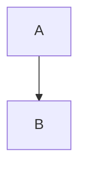

# Topic Start
Ok I am Fine.
## Second Topic Start
Ok I am also Fine
### Third Topic
Ok We are Fine
**Bold**
***Bold Italic***
*Italic*
~~strike through~~
1. Item One
2. Item Two
- Item 1
- Item 2
    - Item 3
    - Item 4
        - Item 5
        - Item 6
* Item 1
* Item 2

| Header 1 | Header 2 |
|----------|----------|
| Row 1    | Data     |

```python
  def hello_world():
      print("Hello, World!")
```
- [ ] Task 1
- [x] Task 2

> This is a blockquote.

Here is a footnote reference[^1].

[^1]: Footnote text goes here.

